## 目录

[TOC]

## 面试准备

项目实现笔记：https://cyborg2077.github.io/2022/09/29/ReggieTakeOut/
项目优化笔记：https://cyborg2077.github.io/2022/10/18/ReggieOptimization/

> 本项目（瑞吉外卖）是专门为餐饮企业（餐厅、饭店）定制的一款软件产品，包括系统管理后台和移动端应用两部分。其中系统管理后台主要提供给餐饮企业内部员工使用，可以对餐厅的菜品、套餐、订单等进行管理维护。移动端应用主要提供给消费者使用，可以在线浏览菜品、添加购物车、下单等。

- 使用了统一结果封装类Result，比如提示结果状态码信息200，登录退出功能用PostMapping，使用过滤器或拦截器判断用户是否登录`@WebFilter` filterChain.doFilter(request, response);在启动类上加入注解`@ServletComponentScan`当符合未登录状态的条件时，会自动重定向到登录页面。里需要导一下fastjson的坐标。退出登功能的实现只要删除掉session就行，`request.getSession().removeAttribute("employee");`

- 使用Lombok 库的注解@slf4j打印日志。

- 管理员前台添加员工时的username不能重复，因为数据库中设计了username唯一unique，否则会报错“**SQL 完整性约束违规异常**”`java.sql.SQLIntegrityConstraintViolationException: Duplicate entry 'Kyle' for key 'employee.idx_username'`前端也会提示错误，因为使用了一个全局异常处理类`GlobalExceptionHandler`，添加 **@ExceptionHandler**(SQLIntegrityConstraintViolationException.class)来捕获这个异常。在后面的新增菜品中也需要处理这个问题，菜品名称也是唯一的。

- mybatis plus分页查询`MybatisPlusInterceptor`和`PaginationInnerInterceptor`

  ```java
  @Configuration
  public class MybatisPlusConfig {
      @Bean
      public MybatisPlusInterceptor mybatisPlusInterceptor() {
          MybatisPlusInterceptor mybatisPlusInterceptor = new MybatisPlusInterceptor();
          mybatisPlusInterceptor.addInnerInterceptor(new PaginationInnerInterceptor());
          return mybatisPlusInterceptor;
      }
  }
  ```

  

- JavaScript中没有Long型，而员工id是java中的long型数据，数据较大，JavaScript处理数据时会丢失精度（比如管理员根据id删除员工），导致提交的id和数据库中的id不一致。数据库中设置的是BigInt。因为使用了MyBatis plus的自带的insert方法添加到数据库，所以员工id自增变的很长，为long型，数据表中为BigInt型。

  解决办法：在服务端给页面响应json数据时进行处理，将Long型数据统一转为String字符串。配置对象映射器：基于**jackson**，将Java对象转为json，或者将json转为Java对象。将JSON解析为Java对象的过程称为 【从JSON反序列化Java对象】，从Java对象生成JSON的过程称为 【序列化Java对象到JSON】

- 线程的使用：在公共字段的填充，使用MyBatis Plus，在实体类的属性上方加入`@TableFiled`注解，指定自动填充的策略。客户端发送的每次http请求，对应的在服务端都会分配一个新的线程来处理，在处理过程中涉及到下面类中的方法都属于相同的一个线程:

  ```java
  LoginCheekFilter中的doFilter方法
  EmployeeController中的update方法
  MyMetaObjectHandler中的updateFill方法
  ```

  获取当前登录用户的id（因为需要知道是谁进行了添加和修改）值需要使用到ThreadLocal，每一个线程都可以独立地改变自己的副本，而不会影响其它线程所对应的副本，ThreadLocal为每个线程提供单独一份存储空间，具有线程隔离的效果，只有在线程内才能获取到对应的值，线程外则不能访问。

  ```
  ThreadLocal常用方法:
  
  public void set(T value) 设置当前线程的线程局部变量的值
  public T get() 返回当前线程所对应的线程局部变量的值
  ```

  可以在`LoginCheckFilter`的`doFilter`方法中获取当前登录用户id，并调用`ThreadLocal`的`set`方法来设置当前线程的线程局部变量的值（用户id)，然后在`MyMetaObjectHandler`的`updateFill`方法中调用`ThreadLocal`的`get`方法来获得当前线程所对应的线程局部变量的值（用户id)。

- 异常处理：①上面的SQL 完整性约束违规异常；②删除菜品时要是关联了其它菜品则不能删除，抛出一个自定义异常`CustomException`，提示不能删除。还有在删除菜品和套餐时，要先停售才能删除，否则也抛出自定义的异常。购物车数据为空不能下单、地址有误不能下单。

  ```java
  public class CustomException extends RuntimeException{
      public CustomException(String msg){
          super(msg);
      }
  }
  ```

  ③邮箱验证登录时可能会出现“身份验证失败异常”`AuthenticationFailedException`，重新获取一下QQ邮箱的授权码并更新授权码。
  
  ④登录获取验证码时，如果在从session中取code验证码的时候报`java.lang.NullPointerException`，清除浏览器缓存之后再次测试。
  
  ⑤在进行MySQL数据库的读写分离时，可能会出现SQL功能不支持异常`SQLFeatureNotSupportedException`，需要修改pom.xml中druid的maven坐标为
  
  ```xml
  <dependency>
      <groupId>com.alibaba</groupId>
      <artifactId>druid-spring-boot-starter</artifactId>
      <version>1.1.20</version>
  </dependency>
  ```
  
  
  
- 文件上传与下载：服务端要接收客户端页面`上传`的文件，通常都会使用Apache的两个组件：`commons-fileupload和commons-io`

- DTO，全称为`Data Transfer Object`，即数据传输对象，一般用于展示层与服务层之间的数据传输。因为Dish实体类不满足接收flavor参数，即需要导入DishDto，用于封装页面提交的数据。

- 邮箱注册登录，开启POP3/STMP服务，获取一个16位的授权码（QQ邮箱）

- Redis的使用：（**redisTemplate**）

  - **缓存短信验证码**：当用户数量足够多的时候，系统访问量大，频繁的访问数据库，系统性能下降，用户体验差，所以一些通用、常用的数据，我们可以使用Redis来缓存，避免用户频繁访问数据库。

    Maven中导入`spring-boot-starter-data-redis`坐标（这个坐标中有`RedisTemplate`），之前的登录获取的验证码存在session中，现在把验证码存在Redis中。

    ```
    具体实现思路如下：
    在服务端UserController中注入RedisTemplate对象，用于操作Redis;
    在服务端UserController的sendMsg方法中，将随机生成的验证码缓存到Redis中，并设置有效期为5分钟;
    在服务端UserController的login方法中，从Redis中获取缓存的验证码，如果登录成功则删除Redis中的验证码;
    ```

    ```
    String code = MailUtils.achieveCode();	////随机生成一个验证码，MailUtils是自己定义的工具类
    ```

  - **缓存菜品数据**：菜品数据是我们登录移动端之后的展示页面，所以每当我们访问首页的时候，都会调用数据库查询一遍菜品数据，对于这种需要频繁访问的数据，我们可以将其缓存到Redis中以减轻服务器的压力。

    ```
    具体实现思路如下：
    修改DishController中的list（菜品查看功能）方法，先从Redis中获取分类对应的菜品数据，如果有，则直接返回；如果无，则查询数据库，并将查询到的菜品数据存入Redis
    修改DishController的save、update和delete方法，加入清理缓存的逻辑，避免产生脏数据（我们实际已经在后台修改/更新/删除了某些菜品，但由于缓存数据未被清理，未重新查询数据库，用户看到的还是我们修改之前的数据）
    ```

    ```java
    dishDtoList = (List<DishDto>) redisTemplate.opsForValue().get(key);//先从Redis中获取数据
    ```

    

- 数据库的读写分离：MySQL的主从复制，写操作交给主库，读操作交给从库，同时将主库写入的内容，同步到从库中。

  MySQL主从复制是一个异步的复制过程，MySQL复制过程分成三步:

  ```
  master将改变记录到二进制日志(binary log)
  slave将master的binary log拷贝到它的中继日志(relay log)
  slave重做中继日志中的事件，将改变应用到自己的数据库中
  ```

  ```mysql
  show slave status;	-- 执行SQL，查看从库的状态
  ```

  

- 项目部署：将项目打成jar包，上传Linux服务器，使用`nohup`命令部署项目

  ```shell
  nohup java -jar boot工程.jar &> hello.log &    #后台运行java -jar命令，并将日志输出到hello.log文件
  # nohup 命令用于使应用程序在后台运行，并忽略 HUP (hangup) 信号，这样即使注销登录或关闭终端，应用程序仍然可以继续运行。
  # &> 操作符用于将标准输出和标准错误输出都重定向到一个文件中。
  # & 操作符用于将整个命令放入后台运行，这样可以在终端中继续输入其他命令。
  ```
  
  停止运行：先查找该进程，再将该进程杀掉
  
  ```shell
  ps -ef | grep 'java -jar'
  ```
  
  ```shell
  kill[参数][进程号]
  kill -9 [进程号]	#9代表强制终止
  ```
  
  


### 1、技术介绍

```
后端技术：SpringMVC、Spring Boot、Mybatis Plus、MySQL、Redis、Spring Cache
前端技术：Vue、Element UI
项目简介：本项目是一个为个体商店定制的订单服务系统，分为系统管理后台和移动端应用两部分。管理后台给商店的管理员使用，可以对商品和员工进行管理。移动应用端给消费者使用，可以在线浏览商品、下单等。
```

> **SpringMVC**

可以将Spring Boot和Spring MVC一起使用，使用Spring Boot构建可独立运行的Spring应用程序，使用Spring MVC构建Web应用程序。在Spring Boot中，可以使用Spring MVC作为Web框架来处理HTTP请求和响应。Spring Boot自动配置了Spring MVC，并集成了许多其他功能，如静态资源处理、模板引擎、表单处理等，使得开发者可以更加方便地构建Web应用程序。

如果使用Spring Boot来开发Web应用程序，那么实际上就是使用了Spring MVC，因为Spring Boot默认集成了Spring MVC框架，用于处理Web请求和响应。

**spring mvc < spring <springboot**

> **Redis**

**缓存短信验证码**：当用户数量足够多的时候，系统访问量大，频繁的访问数据库，系统性能下降，用户体验差，所以一些通用、常用的数据，我们可以使用Redis来缓存，避免用户频繁访问数据库。

**缓存菜品数据**：菜品数据是我们登录移动端之后的展示页面，所以每当我们访问首页的时候，都会调用数据库查询一遍菜品数据，对于这种需要频繁访问的数据，我们可以将其缓存到Redis中以减轻服务器的压力。

> **Vue**

vue在客户前台和后台管理的前端页面中都使用到了，由于不是前后端分离的项目，所以在html文件里使用了vue，放在body标签的script标签里，如：

```JavaScript
<body>
    <script>
        new Vue({
            el:"#address",
            data(){ }
        })
    </script>
 </body>
```

> **Element UI**

Element UI在客户前台和后台管理的前端页面中都使用到了，主要是用来设计一些组件样式，放在body标签中的div标签里如：

```html
<body>
    <div>
        <el-button
  		size="medium"
  		@click="classData.dialogVisible = false"
		>取 消</el-button>
    </div>
</body>
```

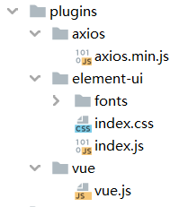

### 2、项目模块介绍

1. common：该模块一般包含项目中通用的工具类、常量、异常等等，是整个项目的基础模块。

   ```
   R：通用返回结果，服务端响应的数据最终都会封装成此对象
   GlobalExceptionHandler：全局异常处理
   CustomException：自定义业务异常类
   BaseContext：基于ThreadLocal封装工具类，用户保存和获取当前登录用户id
   JacksonObjectMapper：对象映射器，基于jackson将Java对象转为json，或者将json转为Java对象
   MyMetaObjecthandler：自定义元数据对象处理器，公共字段的填充
   ```

2. config：该模块一般包含项目的配置文件、配置类以及与第三方组件的集成配置等等。在Spring Boot中，通常使用@Configuration注解来标识该模块。

   ```
   MybatisPlusConfig：配置mybatis plus的分页插件
   WebMvcConfig：静态资源映射
   ```

3. controller：该模块一般包含项目中的控制层代码，主要负责接收请求、调用服务层处理业务逻辑并返回响应结果等等。

   ```
   AddressBookController：地址簿管理
   CategoryController：菜品分类管理
   CommonController：文件上传和下载
   DishController：菜品管理
   EmployeeController：员工管理
   OrderController：订单管理
   OrderDetailController：订单明细
   SetmealController：套餐管理
   ShoppingCartController：购物车管理
   UserController：顾客注册与登录管理
   ```

4. dto：该模块一般包含项目中的**数据传输对象**（DTO），通常用于在控制层和服务层之间传输数据。DTO通常是一个轻量级的Java Bean，只包含一些属性和getter/setter方法，不包含业务逻辑。

   ```
   DishDto：菜品数据传输对象：继承了实体类Dish，又增加了一些属性，如菜品口味、菜品分类名
   OrdersDto：订单数据传输对象：继承了实体类Orders，又增加了一些属性，如下单者的姓名、电话、地址、订单详细
   SetmealDto：套餐数据传输对象：继承了实体类Setmeal，又增加了一些属性，如套餐菜品关系、套餐分类名称
   ```

   > **已经有entity了，为什么还要有dto？**
   >
   > 在一个Spring Boot项目中，实体类和DTO的使用场景有所不同。实体类主要用于持久层，负责与数据库进行交互，而DTO主要用于在控制层和服务层之间传输数据。实体类中的属性通常与数据库表中的字段一一对应，而DTO中的属性通常与业务需求相关，可能包含多个实体类中的属性。DTO还可以对实体类中的属性进行一些转换或者校验，例如将时间戳转换为日期格式，或者校验用户输入的数据格式是否正确等等。
   >
   > 使用DTO可以帮助隔离实体类与外部接口之间的差异，从而提高项目的灵活性和可维护性。例如，当实体类的属性发生变化时，如果直接在外部接口中使用实体类，就需要同时修改外部接口的代码。而如果使用DTO，就可以只修改DTO中的属性，而不需要修改外部接口的代码，从而降低了修改代码的风险和成本。
   >
   > 此外，DTO还可以帮助解决懒加载问题。在某些情况下，实体类中可能会包含大量的关联属性，如果直接将实体类返回给控制层，可能会导致懒加载问题，影响系统性能。而使用DTO可以只选择需要的属性进行传输，从而避免了懒加载问题。

5. entity：该模块一般包含项目中的实体类，主要用于与数据库表进行映射。实体类通常包含与表中字段对应的属性和getter/setter方法，以及一些用于操作数据库的方法。

   ```
   AddressBook：地址簿
   Category：菜品分类
   Dish：菜品
   DishFlavor：菜品口味
   Employee：员工实体
   OrderDetail：订单明细
   Orders：订单
   Setmeal：套餐
   SetmealDish：套餐菜品关系
   ShoppingCart：购物车
   User：顾客实体
   ```

6. filter：该模块一般包含项目中的过滤器，主要用于在请求进入控制层前或者响应返回前进行一些处理，例如权限控制、日志记录等等。

   ```
   LoginCheckFliter：检查用户是否已经完成登录
   ```

7. mapper：该模块一般包含项目中的**持久层代码，主要负责与数据库进行交互**。在MyBatis中，Mapper通常是一个接口，其中定义了一些方法用于操作数据库。

   这个文件是一个接口文件，是各个实体对应的Mapper接口，如AddressBookMapper、CategoryMapper等，由于使用了MyBatis plus，所以AddressBookMapper这些Mapper文件没有写代码，只是继承了接口BaseMapper<对应的实体>，这样就不用写xml文件了，如：

   ```java
   @Mapper
   public interface AddressBookMapper extends BaseMapper<AddressBook> {
   }
   ```

   > **如果使用MyBatis Plus，继承了BaseMapper接口的Mapper接口不需要手动编写XML文件**，因为MyBatis Plus已经封装好了一系列的CRUD方法，并将对应的SQL语句注入到了XML文件中。同时，MyBatis Plus还提供了很多便捷的查询和更新方法，可以快速实现常见的数据操作需求。当然，**如果需要自定义SQL语句，仍然可以在Mapper接口中使用注解或者手动编写XML文件来实现**。

   **Mapper接口**通常是用于定义与数据库交互的方法，一般会写SQL语句定义、参数定义、返回值定义、方法定义，如：

   ```java
   public interface UserMapper {
       @Select("SELECT * FROM user WHERE id = #{id}")
       User selectUserById(@Param("id") Long id);
   }
   ```

   **Mapper对应的XML文件**一般用于定义SQL语句的具体实现，包括SQL语句的编写、参数的传递以及结果的映射等。

8. service：该模块一般包含项目中的服务层代码，主要负责处理业务逻辑。服务层通常会调用持久层的代码进行数据操作，然后返回结果给控制层。

   这个主要是各个实体类对应的service和serviceImpl，由于使用了MyBatis plus，所以有的service和serviceImpl并没有写具体的代码，service继承了IService接口、serviceImpl继承了ServiceImpl类，如：

   ```java
   public interface DishFlavorService extends IService<DishFlavor> {
   }
   ```

   ```java
   @Service
   public class DishFlavorServiceImpl extends ServiceImpl<DishFlavorMapper, DishFlavor> implements DishFlavorService {
   }
   ```

   > **使用MyBatis plus写service层和service层的实现类，为什么可以不写具体的代码?**
   >
   > MyBatis Plus 提供了 IService 和 ServiceImpl 两个类。 **IService** 接口定义了一些常用的数据操作方法，例如 save、update、remove、getById 等。**ServiceImpl** 类继承了BaseMapper，并实现了接口IService，定义了一些SQL操作方法。
   >
   > 使用 MyBatis Plus 的 Service 和实现类，我们只需要在 Service 接口中继承 IService接口，然后创建一个继承自 ServiceImpl 类的实现类即可。在实现类中，我们可以直接调用 BaseMapper接口中定义的方法，无需手动编写具体的数据操作代码。

9. utils：该模块一般包含一些工具类，例如日期处理、加密解密、文件操作等等。这些工具类通常是静态方法，可以在项目的任何地方使用。

   ```
   SMSUtils：短信发送工具类，使用了阿里云短信服务的Java SDK，通过调用SDK中提供的API实现短信发送功能。使用了邮箱替代了MailUtils
   ValidateCodeUtils：随机生成验证码工具类，客户端登录时有验证码，需要输入验证码
   ```

   

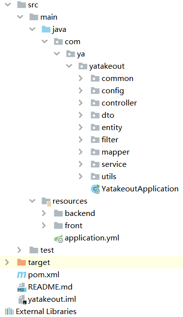

### 3、做了哪些功能，具体说说

就是上面的controller

#### （1）AddressBookController地址簿管理

https://cyborg2077.github.io/2022/09/29/ReggieTakeOut/#%E5%9C%B0%E5%9D%80%E7%B0%BF

- 地址簿，指的是移动端消费者用户的地址信息（外卖快递的收货地址）
- 用户登录成功后可以维护自己的地址信息（自己修改删除新增等）
- 同一个用户可以有多个地址信息，但是只能有一个默认地址。（有默认地址的话会很方便）

设置默认地址：

- 默认地址，按理说数据库中，有且仅有一条数据为默认地址，也就是`is_default`字段为1
- 如何保证整个表中的`is_default`字段只有一条为1
  - 每次设置默认地址的时候，将当前用户所有地址的`is_default`字段设为0，随后将当前地址的`is_default`字段设为1


条件构造器：**LambdaQueryWrapper和LambdaUpdateWrapper**

```java
@Slf4j
@RestController
@RequestMapping("/addressBook")
public class AddressBookController {
    @Autowired
    private AddressBookService addressBookService;
    
    //新增地址
    @PostMapping
    public R<AddressBook> save(@RequestBody AddressBook addressBook) {
        addressBook.setUserId(BaseContext.getCurrentId());	//用到了BaseContext，有ThreadLocal
        log.info("addressBook:{}", addressBook);
        addressBookService.save(addressBook);
        return R.success(addressBook);
    }

    //根据id查询地址
    @GetMapping("/{id}")
    public R get(@PathVariable Long id) {
        AddressBook addressBook = addressBookService.getById(id);
        if (addressBook != null) {
            return R.success(addressBook);
        } else {
            return R.error("没有找到该对象");
        }
    }
    
	//修改地址
    @PutMapping
    public R<String> updateAdd(@RequestBody AddressBook addressBook) {	
        if (addressBook == null) {
            throw new CustomException("地址信息不存在，请刷新重试");
        }
        addressBookService.updateById(addressBook);
        return R.success("地址修改成功!");
    }

    //删除地址
    @DeleteMapping
    public R<String> deleteAdd(@RequestParam("ids") Long id) {	
        if (id == null) {
            throw new CustomException("地址信息不存在，请刷新重试");
        }
        AddressBook addressBook = addressBookService.getById(id);
        if (addressBook == null) {
            throw new CustomException("地址信息不存在，请刷新重试");
        }
        addressBookService.removeById(id);
        return R.success("地址删除成功");
    }
}
```

#### （2）CategoryController菜品分类管理

https://cyborg2077.github.io/2022/09/29/ReggieTakeOut/#%E6%96%B0%E5%A2%9E%E8%8F%9C%E5%93%81%E5%88%86%E7%B1%BB

实体类Category，对应数据库表来创建
Mapper接口CategoryMapper
业务层接口CategoryService
业务层实现类CatrgoryServiceImpl
控制层CategoryController

#### （3）CommonController文件上传和下载

https://cyborg2077.github.io/2022/09/29/ReggieTakeOut/#%E6%96%87%E4%BB%B6%E4%B8%8A%E4%BC%A0%E4%B8%8E%E4%B8%8B%E8%BD%BD

- 文件上传：服务端要接收客户端页面上传的文件，通常都会使用Apache的两个组件:
  - `commons-fileupload`
  - `commons-io`

Spring框架在spring-web包中对**文件上传**进行了封装，大大简化了服务端代码，我们只需要在Controller的方法中声明一个MultipartFile类型的参数即可接收上传的文件，例如：

```java
@RestController
@RequestMapping("/common")
@Slf4j
public class CommonController {
    @PostMapping("/upload")
    public Result<String> upload(MultipartFile file) {
        log.info("获取文件：{}", file.toString());
        return null;
    }
}
```

- 文件下载：通过浏览器进行文件下载，本质上就是服务端将文件以流的形式写回浏览器的过程。

  文件转存的位置改为动态可配置的，通过配置文件的方式指定，在application.yml文件中加入以下内容：

  ```yaml
  yatakeout:
  # 文件上传的保存目录
    path: D:\MyITData\JavaIDEA\JavaProject\yatakeout\img\
  ```

  - 使用 @Value(“${yatakeout.path}”);读取到配置文件中的动态转存位置

    ```java
    @Value("${yatakeout.path}")
    private String basePath;
    ```

  - 使用uuid方式重新生成文件名，避免文件名重复造成文件覆盖

  - 前端页面的ElementUI的upload组件会在上传完图片后，触发img组件发送请求，服务端以流的方式（输出流）将文件写回给浏览器，在浏览器中展示图片

#### （4）DishController菜品管理

新增菜品：https://cyborg2077.github.io/2022/09/29/ReggieTakeOut/#%E6%96%B0%E5%A2%9E%E8%8F%9C%E5%93%81
菜品信息分页查询：https://cyborg2077.github.io/2022/09/29/ReggieTakeOut/#%E8%8F%9C%E5%93%81%E4%BF%A1%E6%81%AF%E5%88%86%E9%A1%B5%E6%9F%A5%E8%AF%A2
根据id查询菜品信息和对应的口味信息：https://cyborg2077.github.io/2022/09/29/ReggieTakeOut/#%E6%9F%A5%E8%AF%A2%E8%8F%9C%E5%93%81%E4%BF%A1%E6%81%AF
菜品(批量)启售/停售：https://cyborg2077.github.io/2022/09/29/ReggieTakeOut/#%E8%8F%9C%E5%93%81%E5%90%AF%E5%94%AE-%E5%81%9C%E5%94%AE
删除菜品：
修改菜品：https://cyborg2077.github.io/2022/09/29/ReggieTakeOut/#%E4%BF%AE%E6%94%B9%E8%8F%9C%E5%93%81
根据条件查询对应的菜品数据：

#### （5）EmployeeController员工管理

添加员工：https://cyborg2077.github.io/2022/09/29/ReggieTakeOut/#%E6%B7%BB%E5%8A%A0%E5%91%98%E5%B7%A5
员工信息分页查询：https://cyborg2077.github.io/2022/09/29/ReggieTakeOut/#%E5%91%98%E5%B7%A5%E4%BF%A1%E6%81%AF%E5%88%86%E9%A1%B5%E6%9F%A5%E8%AF%A2
编辑员工信息：https://cyborg2077.github.io/2022/09/29/ReggieTakeOut/#%E7%BC%96%E8%BE%91%E5%91%98%E5%B7%A5%E4%BF%A1%E6%81%AF

#### （6）OrderController订单管理

https://cyborg2077.github.io/2022/09/29/ReggieTakeOut/#%E7%94%A8%E6%88%B7%E4%B8%8B%E5%8D%95

#### （7）OrderDetailController订单明细

https://cyborg2077.github.io/2022/09/29/ReggieTakeOut/#%E7%94%A8%E6%88%B7%E4%B8%8B%E5%8D%95

#### （8）SetmealController套餐管理

新增套餐：https://cyborg2077.github.io/2022/09/29/ReggieTakeOut/#%E6%96%B0%E5%A2%9E%E5%A5%97%E9%A4%90
套餐信息分页查询：https://cyborg2077.github.io/2022/09/29/ReggieTakeOut/#%E5%A5%97%E9%A4%90%E4%BF%A1%E6%81%AF%E5%88%86%E9%A1%B5%E6%9F%A5%E8%AF%A2
删除套餐：https://cyborg2077.github.io/2022/09/29/ReggieTakeOut/#%E5%88%A0%E9%99%A4%E5%A5%97%E9%A4%90
套餐批量启售/停售：https://cyborg2077.github.io/2022/09/29/ReggieTakeOut/#%E5%A5%97%E9%A4%90%E6%89%B9%E9%87%8F%E5%90%AF%E5%94%AE-%E5%81%9C%E5%94%AE
套餐修改：https://cyborg2077.github.io/2022/09/29/ReggieTakeOut/#%E5%A5%97%E9%A4%90%E4%BF%AE%E6%94%B9

#### （9）ShoppingCartController购物车管理

https://cyborg2077.github.io/2022/09/29/ReggieTakeOut/#%E8%B4%AD%E7%89%A9%E8%BD%A6

#### （10）UserController顾客注册与登录管理

顾客登录：https://cyborg2077.github.io/2022/09/29/ReggieTakeOut/#%E9%82%AE%E4%BB%B6%E5%8F%91%E9%80%81%EF%BC%88%E6%9B%BF%E6%8D%A2%E6%89%8B%E6%9C%BA%E9%AA%8C%E8%AF%81%EF%BC%89
顾客登出：https://cyborg2077.github.io/2022/09/29/ReggieTakeOut/#%E7%99%BB%E5%87%BA%E5%8A%9F%E8%83%BD-1

### 4、遇到了什么难题/错误？最难的是？

- JavaScript中没有Long型，而员工id是java中的long型数据，数据较大，JavaScript处理数据时会丢失精度（比如前台管理员根据id删除员工），导致提交的id和数据库中的id不一致。数据库中设置的是BigInt。因为使用了MyBatis plus的自带的insert方法添加到数据库，所以员工id自增变的很长，为long型，数据表中为BigInt型。

  解决办法：在服务端给页面响应json数据时进行处理，将Long型数据统一转为String字符串。配置对象映射器：基于jackson，将Java对象转为json，或者将json转为Java对象。将JSON解析为Java对象的过程称为 【从JSON反序列化Java对象】，从Java对象生成JSON的过程称为 【序列化Java对象到JSON】

- 项目的部署比较难，部署在了Linux服务器上，第一次直接在Linux系统上使用java -jar运行项目的jar包，但是关闭掉Linux就会停止项目，所以使用了nohup 命令部署。没有采用脚本实现自动部署。https://blog.csdn.net/m0_47114547/article/details/129042632

  - 项目部署：将项目打成jar包，上传Linux服务器，使用`nohup`命令部署项目

    ```shell
    nohup java -jar boot工程.jar &> hello.log &            #后台运行java -jar命令，并将日志输出到hello.log文件
    ```

    停止运行：先查找该进程，再将该进程杀掉

    ```shell
    ps -ef | grep 'java -jar'
    ```

    ```shell
    kill[参数][进程号]
    kill -9 [进程号]	#9代表强制终止
    ```


### 5、用到了多线程吗？

应该有的，使用到了ThreadLocal。`ThreadLocal` 是一种用于多线程环境下的线程安全机制，使用 `ThreadLocal` 就意味着在使用多线程。

`ThreadLocal` 是一个线程本地变量，它的生命周期与线程的生命周期相同。当线程结束时，它的本地变量副本也会被销毁。`ThreadLocal` 允许在多线程环境下创建一个变量副本，每个线程都可以独立地操作自己的变量副本，互相之间不会产生影响。**每个线程都可以通过调用 `threadLocal.get()` 和 `threadLocal.set(value)` 方法来操作自己的本地变量副本，不会产生竞态条件或线程安全问题。**

线程的使用：在公共字段的填充，使用MyBatis Plus，在实体类的属性上方加入`@TableFiled`注解，指定自动填充的策略。客户端发送的每次http请求，对应的在服务端都会分配一个新的线程来处理，在处理过程中涉及到下面类中的方法都属于相同的一个线程:

```java
LocalCheekFilter中的doFilter方法
EmployeeController中的update方法
MyMetaObjectHandler中的updateFill方法
```

获取当前登录用户（员工）的id（**每个员工都可以修改公共字段的信息，需要知道是谁对公共字段的信息进行了添加和修改**）值需要使用到ThreadLocal，每一个线程都可以独立地改变自己的副本，而不会影响其它线程所对应的副本，ThreadLocal为每个线程提供单独一份存储空间，具有线程隔离的效果，只有在线程内才能获取到对应的值，线程外则不能访问。

```java
ThreadLocal常用方法:

public void set(T value) 设置当前线程的线程局部变量的值
public T get() 返回当前线程所对应的线程局部变量的值
```

可以在`LoginCheckFilter`的`doFilter`方法中获取当前登录用户id，使用`request.getSession`来获取当前登录用户的id值。调用`ThreadLocal`的`set`方法来设置当前线程的线程局部变量的值（用户id)，然后在`MyMetaObjectHandler`的`updateFill`方法中调用`ThreadLocal`的`get`方法来获得当前线程所对应的线程局部变量的值（用户id)。

**在common模块中**：

```java
package com.ya.yatakeout.common;
/**
 * 基于ThreadLocal封装工具类，用户保存和获取当前登录用户id
 * @author yagote    create 2023/2/12 19:35
 */
public class BaseContext {
    private static ThreadLocal<Long> threadLocal = new ThreadLocal<>();
    public static void setCurrentId(Long id){	//设置值
        threadLocal.set(id);
    }
    public static Long getCurrentId(){	//获取值
        return threadLocal.get();
    }
}
```

### 6、线程的使用

在MyMetaObjecthandler.java文件中，也属于公共字段填充的内容。

```java
/**
* 更新操作，自动填充
* @param metaObject
*/
@Override
public void updateFill(MetaObject metaObject) {
    log.info("公共字段自动填充[update]...");
    log.info(metaObject.toString());


    long id = Thread.currentThread().getId();
    log.info("线程id为：{}",id);

    metaObject.setValue("updateTime",LocalDateTime.now());
    metaObject.setValue("updateUser",BaseContext.getCurrentId());
}
```

### 7、前端和后端怎么进行连接？

在一个 Spring Boot 项目中，前后端不分离的情况下，前端不需要配置 `http://localhost:8080` 和后端连接，因为前端和后端应用程序运行在同一台服务器上，它们可以通过本地网络接口进行通信，不需要通过网络地址访问后端应用程序。

在这种情况下，前端可以通过使用 Spring Boot 提供的 `RestController` 注解和相应的请求处理方法来实现 RESTful API 接口，然后在前端页面中直接调用这些接口来获取数据或者提交数据。例如：有个后端接口的 URL 为 `/api/users`，前端会自动将这个 URL 解析为 `http://localhost:8080/api/users`，从而访问后端接口（注意：8080端口是在application.yml中进行设置的）。

本项目前后端的连接情况：前端设置统一的api接口文件，在HTML页面中直接使用api接口文件中的方法即可

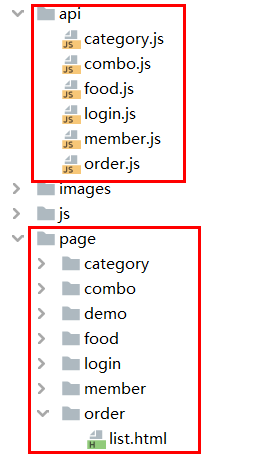

`order.js`

```javascript
// 查询列表页接口
const getOrderDetailPage = (params) => {
  return $axios({
    url: '/order/page',
    method: 'get',
    params
  })
}
// 查看接口
const queryOrderDetailById = (id) => {
  return $axios({
    url: `/orderDetail/${id}`,
    method: 'get'
  })
}
// 取消，派送，完成接口
const editOrderDetail = (params) => {
  return $axios({
    url: '/order',
    method: 'put',
    data: { ...params }
  })
}
```

`backend/page/order/list.html`

```javascript
async init () {
  getOrderDetailPage({ page: this.page, pageSize: this.pageSize, number: this.input || undefined, beginTime: this.beginTime || undefined, endTime: this.endTime || undefined }).then(res => {
    if (String(res.code) === '1') {
      this.tableData = res.data.records || []
      this.counts = res.data.total
    }
  }).catch(err => {
    this.$message.error('请求出错了：' + err)
  })
},
```

`backend/page/order/list.html`文件中使用了`order.js`中的方法`getOrderDetailPage`，`order.js`的`getOrderDetailPage`方法通过axios发送了一个get请求，请求路径为`/order/page`，由于前后端不分离，所以这个路径在前端中会自动拼接为http://localhost:9090/order/page (端口9090是本项目在application.yml文件中进行配置的)


## 项目实现

项目实现笔记：https://cyborg2077.github.io/2022/09/29/ReggieTakeOut/

### 1、基本说明

本系统是基于 SpringBoot+SSM 的个体商店外卖服务系统，前后端不分离。基本功能：

- 后台：

  菜品管理（批量删除、起售停售）
  套餐管理（修改、起售停售）
  订单明细

- 移动端：

  个人中心（退出登录、最新订单查询、历史订单、地址管理-修改地址、地址管理-删除地址）
  购物车（删除购物车中的商品)


开发环境、测试环境、生产环境


#### 1.1 项目介绍

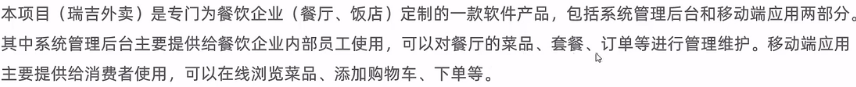

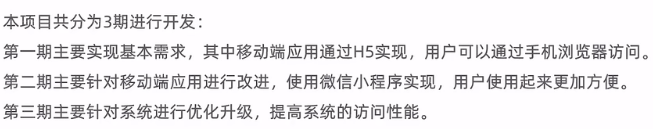

#### 1.2 技术选型

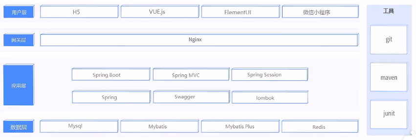

#### 1.3 功能架构

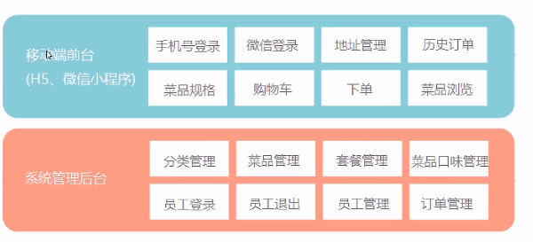

#### 1.4 角色管理

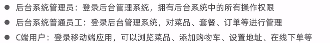


### 2、开发环境搭建

#### 2.1 数据库环境搭建


创建数据库`yatakeout`，导入数据。

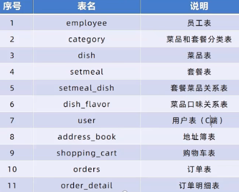

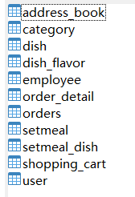

#### 2.3 Maven环境搭建

创建一个普通的Maven项目。其实直接创建一个SpringBoot项目更好。

pom.xml

```xml
<?xml version="1.0" encoding="UTF-8"?>
<project xmlns="http://maven.apache.org/POM/4.0.0"
         xmlns:xsi="http://www.w3.org/2001/XMLSchema-instance"
         xsi:schemaLocation="http://maven.apache.org/POM/4.0.0 http://maven.apache.org/xsd/maven-4.0.0.xsd">
    <modelVersion>4.0.0</modelVersion>

    <parent>
        <groupId>org.springframework.boot</groupId>
        <artifactId>spring-boot-starter-parent</artifactId>
        <version>2.4.5</version>
        <relativePath/> <!-- lookup parent from repository -->
    </parent>

    <groupId>com.ya</groupId>
    <artifactId>yatakeout</artifactId>
    <version>1.0-SNAPSHOT</version>


    <properties>
        <java.version>1.8</java.version>
    </properties>


    <dependencies>

        <dependency>
            <groupId>org.springframework.boot</groupId>
            <artifactId>spring-boot-starter</artifactId>
        </dependency>

        <dependency>
            <groupId>org.springframework.boot</groupId>
            <artifactId>spring-boot-starter-test</artifactId>
            <scope>test</scope>
        </dependency>

        <dependency>
            <groupId>org.springframework.boot</groupId>
            <artifactId>spring-boot-starter-web</artifactId>
            <scope>compile</scope>
        </dependency>

        <dependency>
            <groupId>com.baomidou</groupId>
            <artifactId>mybatis-plus-boot-starter</artifactId>
            <version>3.4.2</version>
        </dependency>

        <dependency>
            <groupId>org.projectlombok</groupId>
            <artifactId>lombok</artifactId>
            <version>1.18.20</version>
        </dependency>

<!--        将对象转JSON-->
        <dependency>
            <groupId>com.alibaba</groupId>
            <artifactId>fastjson</artifactId>
            <version>1.2.76</version>
        </dependency>

<!--        通用的语言包-->
        <dependency>
            <groupId>commons-lang</groupId>
            <artifactId>commons-lang</artifactId>
            <version>2.6</version>
        </dependency>

        <dependency>
            <groupId>mysql</groupId>
            <artifactId>mysql-connector-java</artifactId>
            <scope>runtime</scope>
        </dependency>

        <dependency>
            <groupId>com.alibaba</groupId>
            <artifactId>druid-spring-boot-starter</artifactId>
            <version>1.1.23</version>
        </dependency>

    </dependencies>

    <build>
        <plugins>
            <plugin>
                <groupId>org.springframework.boot</groupId>
                <artifactId>spring-boot-maven-plugin</artifactId>
                <version>2.4.5</version>
            </plugin>
        </plugins>
    </build>


</project>
```

application.yml

```yml
server:
  port: 8080
spring:
  application:
    name: yatakeout
  datasource:
    druid:
      driver-class-name: com.mysql.cj.jdbc.Driver
      url: jdbc:mysql://localhost:3306/yatakeout?serverTimezone=Asia/Shanghai&useUnicode=true&characterEncoding=utf-8&zeroDateTimeBehavior=convertToNull&useSSL=false&allowPublicKeyRetrieval=true
      username: root
      password: 123456
mybatis-plus:
  configuration:
    #开启驼峰命名法，在映射实体或者属性时，将数据库中表名和字段名中的下划线去掉，按照驼峰命名法映射，如address_book----->  AddressBook
    map-underscore-to-camel-case: true
    log-impl: org.apache.ibatis.logging.stdout.StdOutImpl
  global-config:
    db-config:
#      配置数据库主键的生成策略
      id-type: ASSIGN_ID
```

添加启动类

```java
@Slf4j
@SpringBootApplication
public class YatakeoutApplication {
    public static void main(String[] args) {
        SpringApplication.run(YatakeoutApplication.class);
    }
}
```

#### 2.4 添加前端文件

添加前端文件backend、front，设置静态资源映射。

```java
@Slf4j
@Configuration
public class WebMvcConfig extends WebMvcConfigurationSupport {
    /**
     * 设置静态资源映射
     * @param registry
     */
    @Override
    protected void addResourceHandlers(ResourceHandlerRegistry registry) {
        log.info("开始静态资源映射……");
        registry.addResourceHandler("/backend/**").addResourceLocations("classpath:/backend/");
        registry.addResourceHandler("/backend/**").addResourceLocations("classpath:/front/");
    }
}
```


### 3、后台系统登录功能

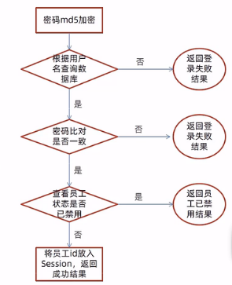

#### 3.1 创建

实体类entity（此外还有POJO、domain）

创建Service、Controller、Mapper


#### 3.2 通用返回结果类

把所有返回结果封装为R对象，将这种类型返回给前端页面


#### 3.3 调试

登录页面	http://localhost:8080/backend/page/login/login.html

设置断点调试登录功能

登录成功会跳转到页面：http://localhost:8080/backend/index.html

登录成功后浏览器保存的数据：

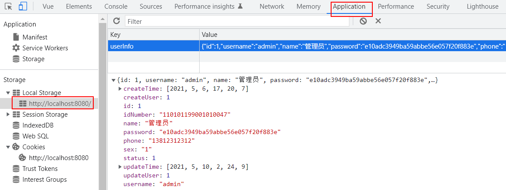


### 4、后台系统退出功能

```java
@PostMapping("/logout")
public R<String> logout(HttpServletRequest request){
    //清理Session中保存的当前登录员工的id
    request.getSession().removeAttribute("employee");
    return R.success("已退出系统！");
}
```

### 5、完善登录功能

没有登录不能看到登录后的界面，要先登录，使用过滤器或拦截器实现。

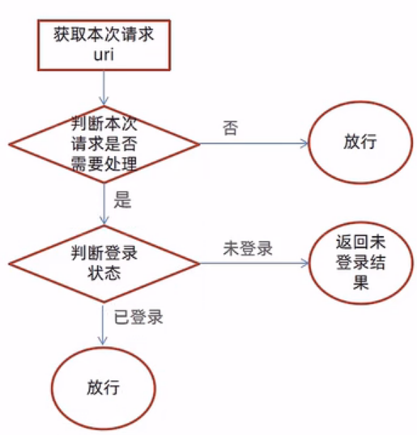

拦截器

```java
@WebFilter(filterName = "loginCheckFliter",urlPatterns = "/*") //拦截所有请求
@Slf4j
public class LoginCheckFliter implements Filter {
    //路径匹配器，支持通配符
    public static final AntPathMatcher PATH_MATCHER = new AntPathMatcher();
    @Override
    public void doFilter(ServletRequest servletRequest, ServletResponse servletResponse, FilterChain filterChain) throws IOException, ServletException {
        HttpServletRequest request = (HttpServletRequest) servletRequest;

        HttpServletResponse response = (HttpServletResponse) servletResponse;
        //1、获取本次请求的URI
        String requestURI = request.getRequestURI();
        log.info("拦截到请求：{}",requestURI);    //  {}是占位符

        //定义不需要处理的请求路径
        String[] urls = new String[]{
                "/employee/login",
                "/employee/logout",
                "/backend/**",
                "/front/**"
        };

        //2、判断本次请求是否需要处理
        boolean check = check(urls, requestURI);

        //3、如果不需要处理，则直接放行
        if(check){
            log.info("本次请求{}不需要处理",requestURI);
            filterChain.doFilter(request,response);
            return;
        }

        //4、判断登录状态，如果已登录，则直接放行
        if(request.getSession().getAttribute("employee") != null){
            log.info("用户已登录，用户id为：{}",request.getSession().getAttribute("employee"));
            filterChain.doFilter(request,response);
            return;
        }

        log.info("用户未登录");
        //5、如果未登录则返回未登录结果，通过输出流方式向客户端页面响应数据
        response.getWriter().write(JSON.toJSONString(R.error("NOTLOGIN")));
        return;

    }

    /**
     * 封装判断路径匹配，检查本次请求是否需要放行
     * @param urls
     * @param requestURI
     * @return
     */
    public boolean check(String[] urls,String requestURI){
        for (String url : urls) {
            boolean match = PATH_MATCHER.match(url, requestURI);
            if(match){
                return true;
            }
        }
        return false;
    }
}
```

### 6、新增员工

username是唯一约束

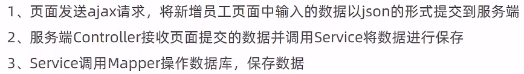

```java
public R<String> save(HttpServletRequest request,@RequestBody Employee employee){
    log.info("新增员工，员工信息{}",employee.toString());
    //设置初始密码123456，进行md5加密处理
    employee.setPassword(DigestUtils.md5DigestAsHex("123456".getBytes()));

    employee.setCreateTime(LocalDateTime.now());
    employee.setUpdateTime((LocalDateTime.now()));

    //获取当前用户登录的id
    Long empId = (Long) request.getSession().getAttribute("employee");
    employee.setCreateUser(empId);
    employee.setUpdateUser(empId);
    employeeService.save(employee);
    return R.success("新增员工成功！");
}
```

判断所添加的员工是否存在，异常处理

```java
@ControllerAdvice(annotations = {RestController.class, Controller.class})
@ResponseBody
@Slf4j
public class GlobalExceptionHandler {
    @ExceptionHandler(SQLIntegrityConstraintViolationException.class)
    public R<String> exceptionHandler(SQLIntegrityConstraintViolationException ex){
        log.error(ex.getMessage());

        if(ex.getMessage().contains("Duplicate entry")){
            String[] split = ex.getMessage().split(" ");
            String msg = split[2] + "该员工已存在";
            return R.error(msg);
        }

        return R.error("未知错误");
    }
}
```

### 7、员工信息分页查询

配置mybatis plus的分页插件

```java
public class MybatisPlusConfig {
    @Bean
    public MybatisPlusInterceptor mybatisPlusInterceptor(){
        MybatisPlusInterceptor mybatisPlusInterceptor = new MybatisPlusInterceptor();
        mybatisPlusInterceptor.addInnerInterceptor(new PaginationInnerInterceptor());
        return mybatisPlusInterceptor;
    }
}
```

```java
@GetMapping("/page")
public R<Page> page(int page, int pageSize, String name){       //name是搜索框输入的信息
    log.info("page = {},pageSize = {},name = {}" ,page,pageSize,name);

    //构造分页构造器
    Page pageInfo = new Page(page,pageSize);

    //构造条件构造器
    LambdaQueryWrapper<Employee> queryWrapper = new LambdaQueryWrapper();
    //添加过滤条件
    queryWrapper.like(StringUtils.isNotEmpty(name),Employee::getName,name); //相似度的查询
    //添加排序条件
    queryWrapper.orderByDesc(Employee::getUpdateTime);

    //执行查询
    employeeService.page(pageInfo,queryWrapper);

    return R.success(pageInfo);
}
```

### 8、启用/禁用员工账号

普通员工只能看到编辑按钮，管理员才可以看到禁用和启用按钮。

主要是前端操作。数据库中员工的状态status==1表示启用，status ==0表示禁用


JSON处理 Long 型数据会丢失精度，所以将id转为字符串，添加文件`JacksonObjectMapper`并扩展mvc框架的消息转换器。

```java
@Override
protected void extendMessageConverters(List<HttpMessageConverter<?>> converters) {
    log.info("扩展消息转换器...");
    //创建消息转换器对象
    MappingJackson2HttpMessageConverter messageConverter = new MappingJackson2HttpMessageConverter();
    //设置对象转换器，底层使用Jackson将Java对象转为json
    messageConverter.setObjectMapper(new JacksonObjectMapper());
    //将上面的消息转换器对象追加到mvc框架的转换器集合中
    converters.add(0,messageConverter);
}
```

### 9、编辑员工信息

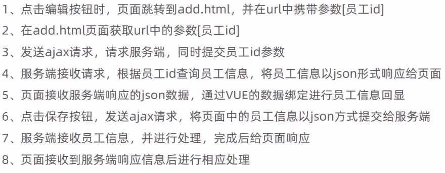


查询员工信息

```java
@GetMapping("/{id}")
public R<Employee> getById(@PathVariable Long id){
    log.info("根据id查询员工信息...");
    Employee employee = employeeService.getById(id);
    if(employee != null){
        return R.success(employee);
    }
    return R.error("没有查询到对应员工信息");
}
```

修改员工信息

```java
@PutMapping
public R<String> update(HttpServletRequest request,@RequestBody Employee employee){
    log.info(employee.toString());

    Long empId = (Long)request.getSession().getAttribute("employee");
    employee.setUpdateTime(LocalDateTime.now());
    employee.setUpdateUser(empId);
    employeeService.updateById(employee);

    return R.success("员工信息修改成功");
}
```

### 10、公共字段自动填充

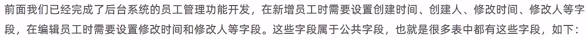


使用注解`@TableField`

使用TreadLocal


### 11、商品分类的CRUD

#### 11.1 新增分类

添加实体类、Service、Impl、Mapper

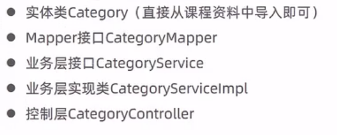

​	

```java
@PostMapping
public R<String> save(@RequestBody Category category){
    log.info("新增分类：{}",category);
    categoryService.save(category);
    return R.success("新增分类成功！");
}
```

#### 11.2 分类信息分页查询

```java
@GetMapping("/page")
public R<Page> page (int page,int pageSize){
    //分页构造器
    Page<Category> pageInfo = new Page<>(page,pageSize);
    //条件构造器
    LambdaQueryWrapper<Category> queryWrapper = new LambdaQueryWrapper<>();
    //添加排序条件
    queryWrapper.orderByAsc(Category::getSort);

    //分页查询
    categoryService.page(pageInfo,queryWrapper);
    return R.success(pageInfo);
}
```


#### 11.3 删除分类

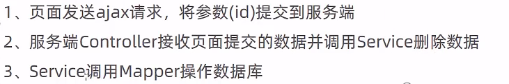

基本删除功能，没有考虑是否关联了其他菜品

```java
@DeleteMapping
public R<String> delete(Long ids){  //这里的变量ids要和前端请求的名称一样
    log.info("删除分类，ids为{}",ids);
    categoryService.removeById(ids);
    return R.success("已删除");
}
```

完善

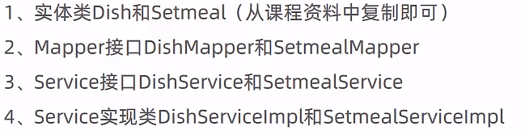

删除前进行判断

```java
@Override
public void remove(Long ids) {
    //1、删除菜品
    LambdaQueryWrapper<Dish> dishLambdaQueryWrapper = new LambdaQueryWrapper<>();
    //添加查询条件，根据分类id进行查询
    dishLambdaQueryWrapper.eq(Dish::getCategoryId,ids);
    int count1 = dishService.count(dishLambdaQueryWrapper);
    if(count1 > 0){
        //已经关联菜品，抛出一个业务异常
        throw new CustomException("当前分类下关联了菜品，不能删除");
    }

    //2、删除套餐
    LambdaQueryWrapper<Setmeal> setmealLambdaQueryWrapper = new LambdaQueryWrapper<>();
    //添加查询条件，根据分类id进行查询
    setmealLambdaQueryWrapper.eq(Setmeal::getCategoryId,ids);
    int count2 = setmealService.count(setmealLambdaQueryWrapper);
    if(count2 > 0){
        //已经关联套餐，抛出一个业务异常
        throw new CustomException("当前分类下关联了套餐，不能删除");
    }

    //3、正常删除分类
    super.removeById(ids);
}
```

```java
    @DeleteMapping
    public R<String> delete(Long ids){  //这里的变量ids要和前端请求的名称一样
        log.info("删除分类，ids为{}",ids);
//        categoryService.removeById(ids);
        categoryService.remove(ids);
        return R.success("已删除");
    }
```

#### 11.4 修改分类

```java
@PutMapping
public R<String> update(@RequestBody Category category){
    log.info("修改分类信息：{}",category);

    categoryService.updateById(category);
    return R.success("修改分类信息成功");
}
```

### 12、文件上传下载

#### 12.1 文件上传

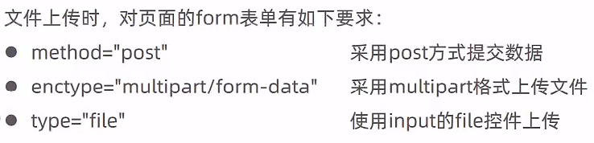


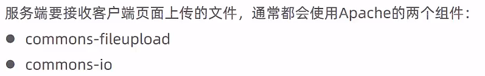


```java
@PostMapping("/upload")
public R<String> upload(MultipartFile file){
    //file是一个临时文件，需要转存到指定位置，否则本次请求完成后临时文件会删除
    log.info(file.toString());

    //原始文件名
    String originalFilename = file.getOriginalFilename();//abc.jpg
    String suffix = originalFilename.substring(originalFilename.lastIndexOf("."));      //截取后缀  .jpg

    //使用UUID重新生成文件名，防止文件名称重复造成文件覆盖
    String fileName = UUID.randomUUID().toString() + suffix;//dfsdfdfd.jpg

    //创建一个目录对象，保存上传的文件
    File dir = new File(basePath);
    //判断当前目录是否存在
    if(!dir.exists()){
        //目录不存在，需要创建
        dir.mkdirs();
    }

    try {
        //将临时文件转存到指定位置
        file.transferTo(new File(basePath + fileName));
    } catch (IOException e) {
        e.printStackTrace();
    }
    return R.success(fileName);
}
```

#### 12.2 文件下载

```java
@GetMapping("/download")
public void download(String name,HttpServletResponse response){
    try {
        //输入流，读取文件内容
        FileInputStream fileInputStream = new FileInputStream(new File(basePath+name));
        //输出流，将文件写回浏览器
        ServletOutputStream outputStream = response.getOutputStream();
        response.setContentType("image/jpeg");  //设置要文件的类型

        int len = 0;
        byte[] bytes = new byte[1024];
        while ((len = fileInputStream.read(bytes))!=-1){    //判断是否读取完
            outputStream.write(bytes,0,len);
            outputStream.flush();
        }
        //关闭资源
        outputStream.close();
        fileInputStream.close();
    }  catch (IOException e) {
        e.printStackTrace();
    }
}
```


### 13、新增菜品

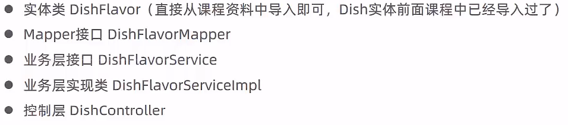

使用DTO传递数据flavor


```java
@Transactional
public void saveWithFlavor(DishDto dishDto) {
    //保存菜品的基本信息到菜品表dish
    this.save(dishDto);

    Long dishId = dishDto.getId();  //菜品id

    //菜品口味
    List<DishFlavor> flavors = dishDto.getFlavors();
    flavors = flavors.stream().map((item) -> {
        item.setDishId(dishId);
        return item;
    }).collect(Collectors.toList());

    //保存菜品口味数据到菜品口味表dish_flavor
    dishFlavorService.saveBatch(flavors);
}
```


### 14、菜品信息分页查询


```java
@GetMapping("/page")
public R<Page> page(int page, int pageSize, String name){

    //构造分页构造器对象
    Page<Dish> pageInfo = new Page<>(page,pageSize);
    Page<DishDto> dishDtoPage = new Page<>();

    //条件构造器
    LambdaQueryWrapper<Dish> queryWrapper = new LambdaQueryWrapper<>();
    //添加过滤条件
    queryWrapper.like(name != null,Dish::getName,name);
    //添加排序条件
    queryWrapper.orderByDesc(Dish::getUpdateTime);

    //执行分页查询
    dishService.page(pageInfo,queryWrapper);

    //对象拷贝
    BeanUtils.copyProperties(pageInfo,dishDtoPage,"records");   //忽略掉属性records

    List<Dish> records = pageInfo.getRecords();

    List<DishDto> list = records.stream().map((item) -> {
        DishDto dishDto = new DishDto();

        BeanUtils.copyProperties(item,dishDto);

        Long categoryId = item.getCategoryId();//分类id
        //根据id查询分类对象
        Category category = categoryService.getById(categoryId);

        if(category != null){
            String categoryName = category.getName();
            dishDto.setCategoryName(categoryName);
        }
        return dishDto;
    }).collect(Collectors.toList());

    dishDtoPage.setRecords(list);

    return R.success(dishDtoPage);
}
```


### 15、菜品的CRUD

#### 15.1 启/停售菜品

```java
@PostMapping("/status/{status}")
public R<String> status(@PathVariable Integer status, @RequestParam List<Long> ids) {
    log.info("status:{},ids:{}", status, ids);
    LambdaUpdateWrapper<Dish> updateWrapper = new LambdaUpdateWrapper<>();
    updateWrapper.in(ids != null, Dish::getId, ids);
    updateWrapper.set(Dish::getStatus, status);
    dishService.update(updateWrapper);
    return R.success("操作成功");
}
```


#### 15.2 修改菜品

```java
@PutMapping
public R<String> update(@RequestBody DishDto dishDto){
    log.info(dishDto.toString());

    dishService.updateWithFlavor(dishDto);

    return R.success("修改菜品成功");
}
```
#### 15.3 删除菜品

```java
@DeleteMapping
public R<String> delete(@RequestParam List<Long> ids) {
    log.info("删除的ids：{}", ids);
    LambdaQueryWrapper<Dish> queryWrapper = new LambdaQueryWrapper<>();
    queryWrapper.in(Dish::getId, ids);
    queryWrapper.eq(Dish::getStatus, 1);
    int count = dishService.count(queryWrapper);
    if (count > 0) {
        throw new CustomException("菜品在售卖，无法删除");
    }
    dishService.removeByIds(ids);
    return R.success("删除成功！");
}
```


### 16、新增套餐

 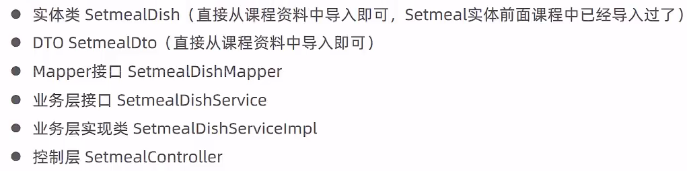


```java
@PostMapping
public R<String> save(@RequestBody SetmealDto setmealDto){
    log.info("套餐信息：{}",setmealDto);

    setmealService.saveWithDish(setmealDto);

    return R.success("新增套餐成功");
}
```


### 17、套餐信息分页查询

```java
@GetMapping("/page")
public R<Page> page(int page, int pageSize, String name){
    //分页构造器对象
    Page<Setmeal> pageInfo = new Page<>(page,pageSize);
    Page<SetmealDto> dtoPage = new Page<>();

    LambdaQueryWrapper<Setmeal> queryWrapper = new LambdaQueryWrapper<>();
    //添加查询条件，根据name进行like模糊查询
    queryWrapper.like(name != null,Setmeal::getName,name);
    //添加排序条件，根据更新时间降序排列
    queryWrapper.orderByDesc(Setmeal::getUpdateTime);

    setmealService.page(pageInfo,queryWrapper);

    //对象拷贝
    BeanUtils.copyProperties(pageInfo,dtoPage,"records");
    List<Setmeal> records = pageInfo.getRecords();

    List<SetmealDto> list = records.stream().map((item) -> {
        SetmealDto setmealDto = new SetmealDto();
        //对象拷贝
        BeanUtils.copyProperties(item,setmealDto);
        //分类id
        Long categoryId = item.getCategoryId();
        //根据分类id查询分类对象
        Category category = categoryService.getById(categoryId);
        if(category != null){
            //分类名称
            String categoryName = category.getName();
            setmealDto.setCategoryName(categoryName);
        }
        return setmealDto;
    }).collect(Collectors.toList());

    dtoPage.setRecords(list);
    return R.success(dtoPage);
}
```

### 18、套餐的CRUD

#### 18.1 停/启售套餐

```java
@PostMapping("/status/{status}")
public Result<String> status(@PathVariable String status, @RequestParam List<Long> ids) {
    LambdaUpdateWrapper<Setmeal> updateWrapper = new LambdaUpdateWrapper<>();
    updateWrapper.in(Setmeal::getId, ids);
    updateWrapper.set(Setmeal::getStatus, status);
    setmealService.update(updateWrapper);
    return Result.success("套餐状态修改成功！");
}
```

#### 18.2 删除套餐

```java
@Transactional
public void removeWithDish(List<Long> ids) {
    //select count(*) from setmeal where id in (1,2,3) and status = 1
    //查询套餐状态，确定是否可用删除
    LambdaQueryWrapper<Setmeal> queryWrapper = new LambdaQueryWrapper();
    queryWrapper.in(Setmeal::getId,ids);
    queryWrapper.eq(Setmeal::getStatus,1);

    int count = this.count(queryWrapper);
    if(count > 0){
        //如果不能删除，抛出一个业务异常
        throw new CustomException("套餐正在售卖中，不能删除");
    }
    //如果可以删除，先删除套餐表中的数据---setmeal
    this.removeByIds(ids);

    //delete from setmeal_dish where setmeal_id in (1,2,3)
    LambdaQueryWrapper<SetmealDish> lambdaQueryWrapper = new LambdaQueryWrapper<>();
    lambdaQueryWrapper.in(SetmealDish::getSetmealId,ids);
    //删除关系表中的数据----setmeal_dish
    setmealDishService.remove(lambdaQueryWrapper);
}
```

#### 18.3 修改套餐

```java
/**
 * 套餐修改--数据回显
 * @param id
 * @return
 */
@GetMapping("/{id}")
public R<SetmealDto> getById(@PathVariable Long id) {
    Setmeal setmeal = setmealService.getById(id);
    SetmealDto setmealDto = new SetmealDto();
    //拷贝数据
    BeanUtils.copyProperties(setmeal, setmealDto);
    //条件构造器
    LambdaQueryWrapper<SetmealDish> queryWrapper = new LambdaQueryWrapper<>();
    //根据setmealId查询具体的setmealDish
    queryWrapper.eq(SetmealDish::getSetmealId, id);
    List<SetmealDish> setmealDishes = setmealDishService.list(queryWrapper);
    //然后再设置属性
    setmealDto.setSetmealDishes(setmealDishes);
    //作为结果返回
    return R.success(setmealDto);
}


/**
 * 套餐修改----保存修改后的数据
 * @param setmealDto
 * @return
 */
@PutMapping
public R<Setmeal> updateWithDish(@RequestBody SetmealDto setmealDto) {
    List<SetmealDish> setmealDishes = setmealDto.getSetmealDishes();
    Long setmealId = setmealDto.getId();
    //先根据id把setmealDish表中对应套餐的数据删了
    LambdaQueryWrapper<SetmealDish> queryWrapper = new LambdaQueryWrapper<>();
    queryWrapper.eq(SetmealDish::getSetmealId,setmealId);
    setmealDishService.remove(queryWrapper);
    //然后在重新添加
    setmealDishes = setmealDishes.stream().map((item) ->{
        //这属性没有，需要我们手动设置一下
        item.setSetmealId(setmealId);
        return item;
    }).collect(Collectors.toList());
    //更新套餐数据
    setmealService.updateById(setmealDto);
    //更新套餐对应菜品数据
    setmealDishService.saveBatch(setmealDishes);
    return R.success(setmealDto);
}
```

### 19、订单明细

```java
@GetMapping("/page")
public R<Page> page(int page, int pageSize, Long number, String beginTime, String endTime) {
    //获取当前id
    Page<Orders> pageInfo = new Page<>(page, pageSize);
    Page<OrdersDto> ordersDtoPage = new Page<>(page, pageSize);
    //条件构造器
    LambdaQueryWrapper<Orders> queryWrapper = new LambdaQueryWrapper<>();
    //按时间降序排序
    queryWrapper.orderByDesc(Orders::getOrderTime);
    //订单号
    queryWrapper.eq(number != null, Orders::getId, number);
    //时间段，大于开始，小于结束
    queryWrapper.gt(!StringUtils.isEmpty(beginTime), Orders::getOrderTime, beginTime)
            .lt(!StringUtils.isEmpty(endTime), Orders::getOrderTime, endTime);
    orderService.page(pageInfo, queryWrapper);
    List<OrdersDto> list = pageInfo.getRecords().stream().map((item) -> {
        OrdersDto ordersDto = new OrdersDto();
        //获取orderId,然后根据这个id，去orderDetail表中查数据
        Long orderId = item.getId();
        LambdaQueryWrapper<OrderDetail> wrapper = new LambdaQueryWrapper<>();
        wrapper.eq(OrderDetail::getOrderId, orderId);
        List<OrderDetail> details = orderDetailService.list(wrapper);
        BeanUtils.copyProperties(item, ordersDto);
        //之后set一下属性
        ordersDto.setOrderDetails(details);
        return ordersDto;
    }).collect(Collectors.toList());
    BeanUtils.copyProperties(pageInfo, ordersDtoPage, "records");
    ordersDtoPage.setRecords(list);
    //日志输出看一下
    log.info("list:{}", list);
    return R.success(ordersDtoPage);
}
```


> 以下是用户使用端


### 20、手机验证码登录

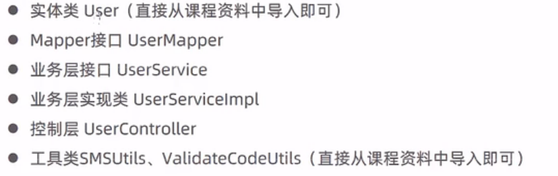

发送验证码

```java
@PostMapping("/sendMsg")
public R<String> sendMsg(@RequestBody User user, HttpSession session){
    //获取手机号
    String phone = user.getPhone();

    if(StringUtils.isNotEmpty(phone)){
        //生成随机的4位验证码
        String code = ValidateCodeUtils.generateValidateCode(4).toString();
        log.info("code={}",code);

        //调用阿里云提供的短信服务API完成发送短信
        //SMSUtils.sendMessage("瑞吉外卖","",phone,code);

        //需要将生成的验证码保存到Session
        session.setAttribute(phone,code);

        return R.success("手机验证码短信发送成功");
    }

    return R.error("短信发送失败");
}
```

登录

```java
@PostMapping("/login")
public R<User> login(@RequestBody Map map, HttpSession session){
    log.info(map.toString());

    //获取手机号
    String phone = map.get("phone").toString();

    //获取验证码
    String code = map.get("code").toString();

    //从Session中获取保存的验证码
    Object codeInSession = session.getAttribute(phone);

    //进行验证码的比对（页面提交的验证码和Session中保存的验证码比对）
    if(codeInSession != null && codeInSession.equals(code)){
        //如果能够比对成功，说明登录成功

        LambdaQueryWrapper<User> queryWrapper = new LambdaQueryWrapper<>();
        queryWrapper.eq(User::getPhone,phone);

        User user = userService.getOne(queryWrapper);
        if(user == null){
            //判断当前手机号对应的用户是否为新用户，如果是新用户就自动完成注册
            user = new User();
            user.setPhone(phone);
            user.setStatus(1);
            userService.save(user);
        }
        session.setAttribute("user",user.getId());
        return R.success(user);
    }
    return R.error("登录失败");
}
```


### 21、导入用户地址簿

 

```java
@Slf4j
@RestController
@RequestMapping("/addressBook")
public class AddressBookController {
    @Autowired
    private AddressBookService addressBookService;

    /**
     * 新增
     */
    @PostMapping
    public R<AddressBook> save(@RequestBody AddressBook addressBook) {
        addressBook.setUserId(BaseContext.getCurrentId());
        log.info("addressBook:{}", addressBook);
        addressBookService.save(addressBook);
        return R.success(addressBook);
    }

    /**
     * 设置默认地址
     */
    @PutMapping("default")
    public R<AddressBook> setDefault(@RequestBody AddressBook addressBook) {
        log.info("addressBook:{}", addressBook);
        LambdaUpdateWrapper<AddressBook> wrapper = new LambdaUpdateWrapper<>();
        wrapper.eq(AddressBook::getUserId, BaseContext.getCurrentId());
        wrapper.set(AddressBook::getIsDefault, 0);
        //SQL:update address_book set is_default = 0 where user_id = ?
        addressBookService.update(wrapper);

        addressBook.setIsDefault(1);
        //SQL:update address_book set is_default = 1 where id = ?
        addressBookService.updateById(addressBook);
        return R.success(addressBook);
    }

    /**
     * 根据id查询地址
     */
    @GetMapping("/{id}")
    public R get(@PathVariable Long id) {
        AddressBook addressBook = addressBookService.getById(id);
        if (addressBook != null) {
            return R.success(addressBook);
        } else {
            return R.error("没有找到该对象");
        }
    }

    /**
     * 查询默认地址
     */
    @GetMapping("default")
    public R<AddressBook> getDefault() {
        LambdaQueryWrapper<AddressBook> queryWrapper = new LambdaQueryWrapper<>();
        queryWrapper.eq(AddressBook::getUserId, BaseContext.getCurrentId());
        queryWrapper.eq(AddressBook::getIsDefault, 1);

        //SQL:select * from address_book where user_id = ? and is_default = 1
        AddressBook addressBook = addressBookService.getOne(queryWrapper);

        if (null == addressBook) {
            return R.error("没有找到该对象");
        } else {
            return R.success(addressBook);
        }
    }

    /**
     * 查询指定用户的全部地址
     */
    @GetMapping("/list")
    public R<List<AddressBook>> list(AddressBook addressBook) {
        addressBook.setUserId(BaseContext.getCurrentId());
        log.info("addressBook:{}", addressBook);

        //条件构造器
        LambdaQueryWrapper<AddressBook> queryWrapper = new LambdaQueryWrapper<>();
        queryWrapper.eq(null != addressBook.getUserId(), AddressBook::getUserId, addressBook.getUserId());
        queryWrapper.orderByDesc(AddressBook::getUpdateTime);

        //SQL:select * from address_book where user_id = ? order by update_time desc
        return R.success(addressBookService.list(queryWrapper));
    }

}
```


### 22、菜品展示

在front的main.js 中注释了

```js
//获取购物车内商品的集合
function cartListApi(data) {
    return $axios({
        //'url': '/shoppingCart/list',
        'url': '/front/cartData.json',
        'method': 'get',
        params:{...data}
    })
}
```

```java
@GetMapping("/list")
public R<List<Setmeal>> list(Setmeal setmeal){
    LambdaQueryWrapper<Setmeal> queryWrapper = new LambdaQueryWrapper<>();
    queryWrapper.eq(setmeal.getCategoryId() != null,Setmeal::getCategoryId,setmeal.getCategoryId());
    queryWrapper.eq(setmeal.getStatus() != null,Setmeal::getStatus,setmeal.getStatus());
    queryWrapper.orderByDesc(Setmeal::getUpdateTime);

    List<Setmeal> list = setmealService.list(queryWrapper);

    return R.success(list);
}
```

### 23、购物车

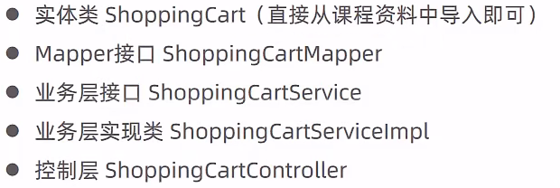


#### 22.1 添加购物车

```java
@PostMapping("/add")
public R<ShoppingCart> add(@RequestBody ShoppingCart shoppingCart){
    log.info("购物车数据:{}",shoppingCart);

    //设置用户id，指定当前是哪个用户的购物车数据
    Long currentId = BaseContext.getCurrentId();
    shoppingCart.setUserId(currentId);

    Long dishId = shoppingCart.getDishId();

    LambdaQueryWrapper<ShoppingCart> queryWrapper = new LambdaQueryWrapper<>();
    queryWrapper.eq(ShoppingCart::getUserId,currentId);

    if(dishId != null){
        //添加到购物车的是菜品
        queryWrapper.eq(ShoppingCart::getDishId,dishId);

    }else{
        //添加到购物车的是套餐
        queryWrapper.eq(ShoppingCart::getSetmealId,shoppingCart.getSetmealId());
    }

    //查询当前菜品或者套餐是否在购物车中
    //SQL:select * from shopping_cart where user_id = ? and dish_id/setmeal_id = ?
    ShoppingCart cartServiceOne = shoppingCartService.getOne(queryWrapper);

    if(cartServiceOne != null){
        //如果已经存在，就在原来数量基础上加一
        Integer number = cartServiceOne.getNumber();
        cartServiceOne.setNumber(number + 1);
        shoppingCartService.updateById(cartServiceOne);
    }else{
        //如果不存在，则添加到购物车，数量默认就是一
        shoppingCart.setNumber(1);
        shoppingCart.setCreateTime(LocalDateTime.now());
        shoppingCartService.save(shoppingCart);
        cartServiceOne = shoppingCart;
    }

    return R.success(cartServiceOne);
}
```

#### 22.2 查看购物车

```java
@GetMapping("/list")
public R<List<ShoppingCart>> list(){
    log.info("查看购物车...");

    LambdaQueryWrapper<ShoppingCart> queryWrapper = new LambdaQueryWrapper<>();
    queryWrapper.eq(ShoppingCart::getUserId,BaseContext.getCurrentId());
    queryWrapper.orderByAsc(ShoppingCart::getCreateTime);

    List<ShoppingCart> list = shoppingCartService.list(queryWrapper);

    return R.success(list);
}
```


#### 22.3 清空购物车

```java
@DeleteMapping("/clean")
public R<String> clean(){
    //SQL:delete from shopping_cart where user_id = ?

    LambdaQueryWrapper<ShoppingCart> queryWrapper = new LambdaQueryWrapper<>();
    queryWrapper.eq(ShoppingCart::getUserId,BaseContext.getCurrentId());

    shoppingCartService.remove(queryWrapper);

    return R.success("清空购物车成功!");
}
```

#### 22.4 取消加入购物车

```java
@PostMapping("/sub")
public R<ShoppingCart> sub(@RequestBody ShoppingCart shoppingCart) {
    Long dishId = shoppingCart.getDishId();
    Long setmealId = shoppingCart.getSetmealId();
    //条件构造器
    LambdaQueryWrapper<ShoppingCart> queryWrapper = new LambdaQueryWrapper<>();
    //只查询当前用户ID的购物车
    queryWrapper.eq(ShoppingCart::getUserId, BaseContext.getCurrentId());
    //代表数量减少的是菜品数量
    if (dishId != null) {
        //通过dishId查出购物车菜品数据
        queryWrapper.eq(ShoppingCart::getDishId, dishId);
        ShoppingCart dishCart = shoppingCartService.getOne(queryWrapper);
        //将查出来的数据的数量-1
        dishCart.setNumber(dishCart.getNumber() - 1);
        Integer currentNum = dishCart.getNumber();
        //然后判断
        if (currentNum > 0) {
            //大于0则更新
            shoppingCartService.updateById(dishCart);
        } else if (currentNum == 0) {
            //小于0则删除
            shoppingCartService.removeById(dishCart.getId());
        }
        return R.success(dishCart);
    }

    if (setmealId != null) {
        //通过setmealId查询购物车套餐数据
        queryWrapper.eq(ShoppingCart::getSetmealId, setmealId);
        ShoppingCart setmealCart = shoppingCartService.getOne(queryWrapper);
        //将查出来的数据的数量-1
        setmealCart.setNumber(setmealCart.getNumber() - 1);
        Integer currentNum = setmealCart.getNumber();
        //然后判断
        if (currentNum > 0) {
            //大于0则更新
            shoppingCartService.updateById(setmealCart);
        } else if (currentNum == 0) {
            //等于0则删除
            shoppingCartService.removeById(setmealCart.getId());
        }
        return R.success(setmealCart);
    }
    return R.error("别乱搞，受不了了");
}
```


### 24、下单


```java
@Transactional
    public void submit(Orders orders) {
        //获得当前用户id
        Long userId = BaseContext.getCurrentId();

        //查询当前用户的购物车数据
        LambdaQueryWrapper<ShoppingCart> wrapper = new LambdaQueryWrapper<>();
        wrapper.eq(ShoppingCart::getUserId,userId);
        List<ShoppingCart> shoppingCarts = shoppingCartService.list(wrapper);

        if(shoppingCarts == null || shoppingCarts.size() == 0){
            throw new CustomException("购物车为空，不能下单");
        }

        //查询用户数据
        User user = userService.getById(userId);

        //查询地址数据
        Long addressBookId = orders.getAddressBookId();
        AddressBook addressBook = addressBookService.getById(addressBookId);
        if(addressBook == null){
            throw new CustomException("用户地址信息有误，不能下单");
        }

        long orderId = IdWorker.getId();//订单号

        AtomicInteger amount = new AtomicInteger(0);

        List<OrderDetail> orderDetails = shoppingCarts.stream().map((item) -> {
            OrderDetail orderDetail = new OrderDetail();
            orderDetail.setOrderId(orderId);
            orderDetail.setNumber(item.getNumber());
            orderDetail.setDishFlavor(item.getDishFlavor());
            orderDetail.setDishId(item.getDishId());
            orderDetail.setSetmealId(item.getSetmealId());
            orderDetail.setName(item.getName());
            orderDetail.setImage(item.getImage());
            orderDetail.setAmount(item.getAmount());
            amount.addAndGet(item.getAmount().multiply(new BigDecimal(item.getNumber())).intValue());
            return orderDetail;
        }).collect(Collectors.toList());


        orders.setId(orderId);
        orders.setOrderTime(LocalDateTime.now());
        orders.setCheckoutTime(LocalDateTime.now());
        orders.setStatus(2);
        orders.setAmount(new BigDecimal(amount.get()));//总金额
        orders.setUserId(userId);
        orders.setNumber(String.valueOf(orderId));
        orders.setUserName(user.getName());
        orders.setConsignee(addressBook.getConsignee());
        orders.setPhone(addressBook.getPhone());
        orders.setAddress((addressBook.getProvinceName() == null ? "" : addressBook.getProvinceName())
                + (addressBook.getCityName() == null ? "" : addressBook.getCityName())
                + (addressBook.getDistrictName() == null ? "" : addressBook.getDistrictName())
                + (addressBook.getDetail() == null ? "" : addressBook.getDetail()));
        //向订单表插入数据，一条数据
        this.save(orders);

        //向订单明细表插入数据，多条数据
        orderDetailService.saveBatch(orderDetails);

        //清空购物车数据
        shoppingCartService.remove(wrapper);
    }
```


### 25、订单查看

```java
@GetMapping("/userPage")
public R<Page> page(int page, int pageSize) {
    //获取当前id
    Long userId = BaseContext.getCurrentId();
    Page<Orders> pageInfo = new Page<>(page, pageSize);
    Page<OrdersDto> ordersDtoPage = new Page<>(page, pageSize);
    //条件构造器
    LambdaQueryWrapper<Orders> queryWrapper = new LambdaQueryWrapper<>();
    //查询当前用户id订单数据
    queryWrapper.eq(userId != null, Orders::getUserId, userId);
    //按时间降序排序
    queryWrapper.orderByDesc(Orders::getOrderTime);
    orderService.page(pageInfo, queryWrapper);
    List<OrdersDto> list = pageInfo.getRecords().stream().map((item) -> {
        OrdersDto ordersDto = new OrdersDto();
        //获取orderId,然后根据这个id，去orderDetail表中查数据
        Long orderId = item.getId();
        LambdaQueryWrapper<OrderDetail> wrapper = new LambdaQueryWrapper<>();
        wrapper.eq(OrderDetail::getOrderId, orderId);
        List<OrderDetail> details = orderDetailService.list(wrapper);
        BeanUtils.copyProperties(item, ordersDto);
        //之后set一下属性
        ordersDto.setOrderDetails(details);
        return ordersDto;
    }).collect(Collectors.toList());
    BeanUtils.copyProperties(pageInfo, ordersDtoPage, "records");
    ordersDtoPage.setRecords(list);
    //日志输出看一下
    log.info("list:{}", list);
    return R.success(ordersDtoPage);
}
```


## 项目优化

项目优化笔记：https://cyborg2077.github.io/2022/10/18/ReggieOptimization/

### 1、缓存优化

#### 1.1 Redis环境配置

##### 1.1.1 导入坐标

```xml
<dependency>
    <groupId>org.springframework.boot</groupId>
    <artifactId>spring-boot-starter-data-redis</artifactId>
</dependency>
```
##### 1.1.2 配置Redis

```yaml
spring：  
  redis:
    host: 172.17.2.94
    port: 6379
    password: root@123456
    database: 0
```

##### 1.1.3 Redis配置类

```java
@Configuration
public class RedisConfig extends CachingConfigurerSupport {
    @Bean
    public RedisTemplate<Object, Object> redisTemplate(RedisConnectionFactory connectionFactory) {
        RedisTemplate<Object, Object> redisTemplate = new RedisTemplate<>();
        //默认的Key序列化器为：JdkSerializationRedisSerializer
        redisTemplate.setKeySerializer(new StringRedisSerializer());
        redisTemplate.setConnectionFactory(connectionFactory);
        return redisTemplate;
    }
}
```

#### 1.2 缓存短信验证码

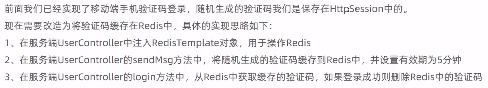

在UserController中进行编写代码

```java
@Autowired
private RedisTemplate redisTemplate;
```

@PostMapping("/sendMsg")

```java
//需要将生成的验证码保存到Session
//session.setAttribute(phone,code);

//将生成的验证码缓存到Redis中，并且设置有效期为5分钟
redisTemplate.opsForValue().set(phone,code,5,TimeUnit.MINUTES);
```

 @PostMapping("/login")

```java
//从Session中获取保存的验证码
//Object codeInSession = session.getAttribute(phone);

//从Redis中获取缓存的验证码
Object codeInSession = redisTemplate.opsForValue().get(phone);
```

@PostMapping("/login")

```java
//如果用户登录成功，删除Redis中缓存的验证码
redisTemplate.delete(phone);
```

测试：


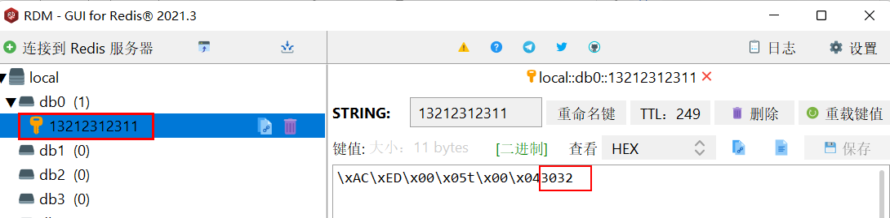


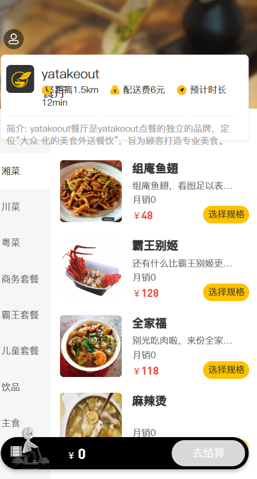

登录成功后验证码缓存消失

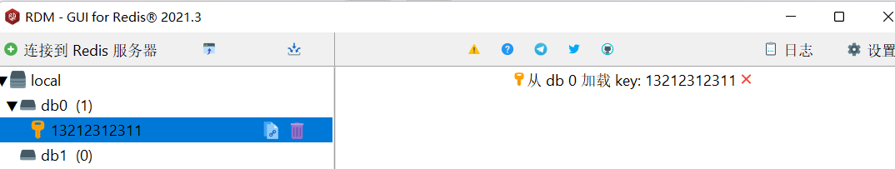


#### 1.3 缓存菜品数据

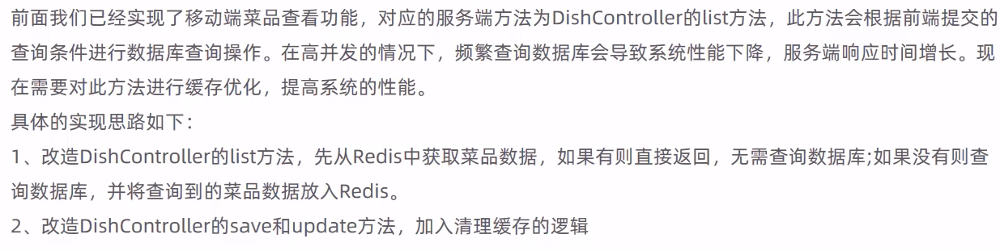

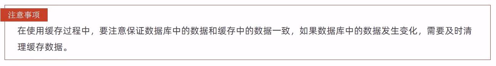

**根据菜品分类进行缓存。**

##### 1.3.1 DishController缓存菜品数据

```java
@Autowired
private RedisTemplate redisTemplate;
```

 @GetMapping("/list")

```java
List<DishDto> dishDtoList = null;
//动态构造key，因为要根据菜品分类进行缓存，每个菜品构造一个分类id
String key = "dish_" + dish.getCategoryId() + "_" + dish.getStatus();//dish_1397844391040167938_1

//先从redis中获取缓存数据
dishDtoList = (List<DishDto>) redisTemplate.opsForValue().get(key);

if(dishDtoList != null){
    //如果存在，直接返回，无需查询数据库
    return R.success(dishDtoList);
}
```

 @GetMapping("/list")

```java
//如果不存在，需要查询数据库，将查询到的菜品数据缓存到Redis，设置60分钟后过期
redisTemplate.opsForValue().set(key,dishDtoList,60, TimeUnit.MINUTES);
```

测试

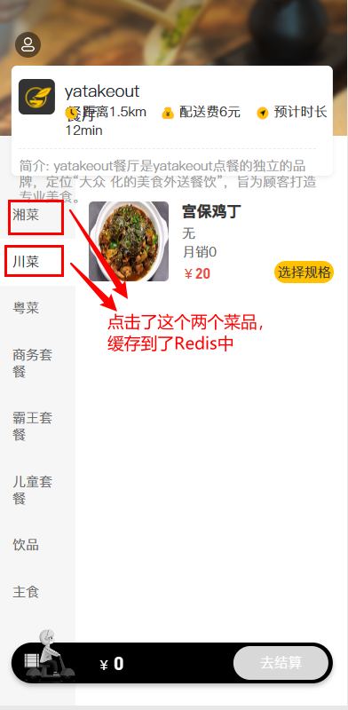


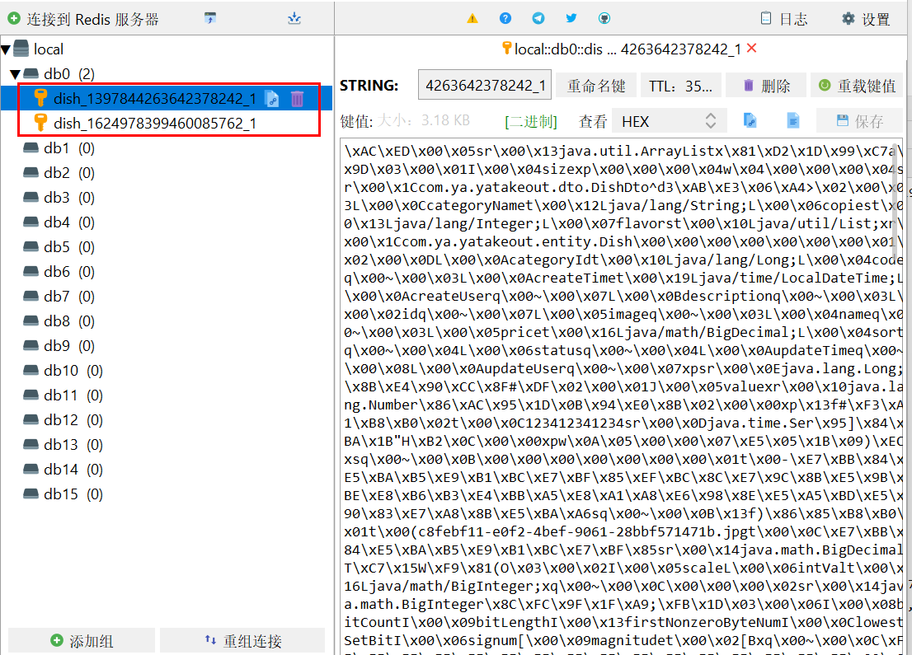

##### 1.3.2 DishController清理菜品缓存数据

（1）清理所有缓存

只要有更新就清理之前的所有缓存。

```java
//在update和save方法中
//清理所有菜品的缓存数据
Set keys = redisTemplate.keys("dish_*");
redisTemplate.delete(keys);
```

（2）精确清理

只清理更新的菜品的缓存，你如菜品1更新了，就只清理菜品1的缓存

```java
//在update和save方法中
//清理某个分类下面的菜品缓存数据
String key = "dish_" + dishDto.getCategoryId() + "_1";	//_1是表示菜品，在之前动态构造id时设置好的
redisTemplate.delete(key);
```


#### 1.4 Spring Cache

Spring Cache是一个基于Spring框架的缓存抽象层，它提供了一种方便的方式来集成各种缓存技术到Spring应用程序中，包括内存、Redis、Ehcache、Gemfire等等。使用Spring Cache可以使应用程序轻松地利用缓存来提高性能和减少对后端系统的负载。

|      注解      |                             说明                             |
| :------------: | :----------------------------------------------------------: |
| @EnableCaching |                       开启缓存注解功能                       |
|   @Cacheable   | 在方法执行前spring先查看缓存中是否有数据。如果有数据，则直接返回缓存数据；若没有数据，调用方法并将方法返回值放到缓存中 |
|   @CachePut    |                   将方法的返回值放到缓存中                   |
|  @CacheEvict   |                将一条或者多条数据从缓存中删除                |


在SpringBoot项目中，使用缓存技术只需要在项目中导入相关缓存技术的依赖包，并在启动类上使用@EnableCaching开启缓存技术支持即可。这里我们使用Redis作为缓存技术，只需要导入Spring data Redis的maven坐标即可。

```xml
<dependency>
    <groupId>org.springframework.boot</groupId>
    <artifactId>spring-boot-starter-data-redis</artifactId>
</dependency>

<dependency>
    <groupId>org.springframework.boot</groupId>
    <artifactId>spring-boot-starter-cache</artifactId>
</dependency>
```

配置application.yml

```yaml
spring:
  redis:
    host: 101.XXX.XXX.160 #这里换成localhost或者你自己的linux上装的redis
    #password: root
    port: 6379
    database: 0
  cache:
    redis:
      time-to-live: 3600000 #设置存活时间为一小时，如果不设置，则一直存活
```


#### 1.5 缓存套餐数据

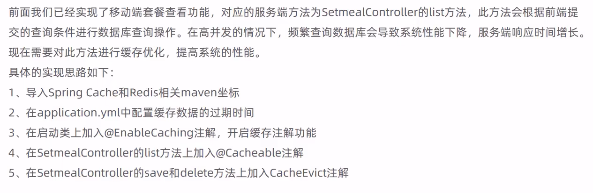


导入SpringCache和Redis相关的maven坐标。

```xml
<dependency>
    <groupId>org.springframework.boot</groupId>
    <artifactId>spring-boot-starter-data-redis</artifactId>
</dependency>
<dependency>
    <groupId>org.springframework.boot</groupId>
    <artifactId>spring-boot-starter-cache</artifactId>
</dependency>
```
在appilcation.yml中配置缓存数据的过期时间

```yaml
spring：
  cache:
    redis:
      time-to-live: 3600000 #设置存活时间为一小时
```

在启动类上加上`@EnableCaching`注解，开启缓存注解功能

```java
@Slf4j
@SpringBootApplication
@ServletComponentScan       //扫描过滤器文件
@EnableTransactionManagement    //开启事务支持
@EnableCaching  //开启缓存注解功能
public class YatakeoutApplication {
    public static void main(String[] args) {
        SpringApplication.run(YatakeoutApplication.class);
        log.info("项目启动成功……");
    }
}
```

在SetmealController的list方法上加上`@Cacheale`注解。该注解的功能是：在方法执行前，Spring先查看缓存中是否有数据；如果有数据，则直接返回缓存数据；若没有数据，调用方法并将方法返回值放到缓存中

```java
@GetMapping("/list")
@Cacheable(value = "setmealCache", key = "#setmeal.categoryId + '_' + #setmeal.status")
```

修改SetmealController的save、update、status和delete方法，加入清理缓存的逻辑，实现手段也只需要加上`@CacheEvict`注解，该注解的功能是：将一条或者多条数据从缓存中删除。

```java
@PostMapping
//设置allEntries为true，清空缓存名称为setmealCache的所有缓存
@CacheEvict(value = "setmealCache", allEntries = true)
public Result<String> save(@RequestBody SetmealDto setmealDto) {...}
```

```java
@PutMapping
//设置allEntries为true，清空缓存名称为setmealCache的所有缓存
@CacheEvict(value = "setmealCache", allEntries = true)
public Result<Setmeal> updateWithDish(@RequestBody SetmealDto setmealDto) {...}
```

```java
@PostMapping("/status/{status}")
//设置allEntries为true，清空缓存名称为setmealCache的所有缓存
@CacheEvict(value = "setmealCache", allEntries = true)
public Result<String> status(@PathVariable String status, @RequestParam List<Long> ids) {...}
```

```java
@DeleteMapping
@CacheEvict(value = "setmealCache",allEntries = true)
public R<String> delete(@RequestParam List<Long> ids){...}
```


> - 在做完这一步之后，会发现报错:`DefaultSerializer requires a Serializable payload but received an object of type`
>
> - 这是因为要缓存的JAVA对象必须实现`Serializable`接口，因为Spring会先将对象序列化再存入Redis，将缓存实体类继承`Serializable`
>
>   ```java
>   public class R<T> implements Serializable
>   ```

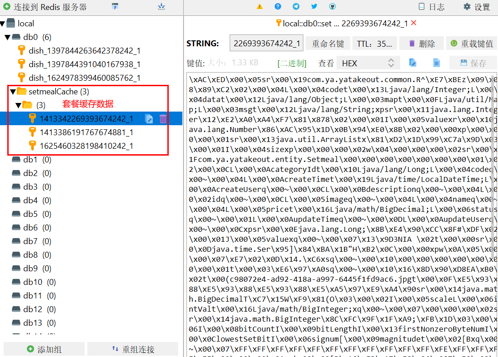


### 2、读写分离

目前数据读写情况：

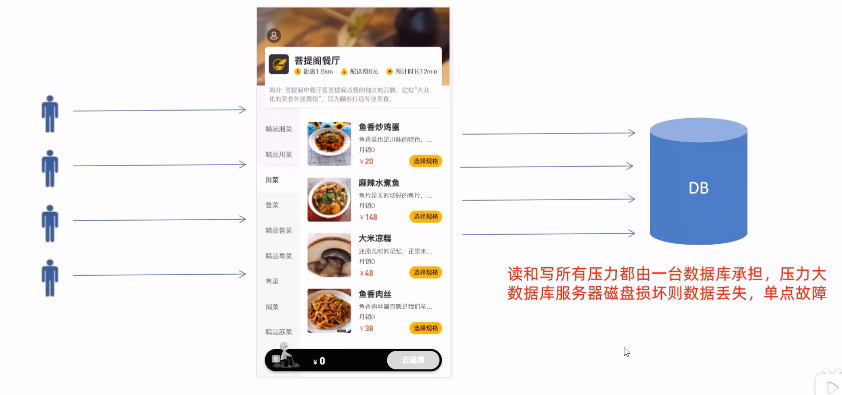

使用读写分离：

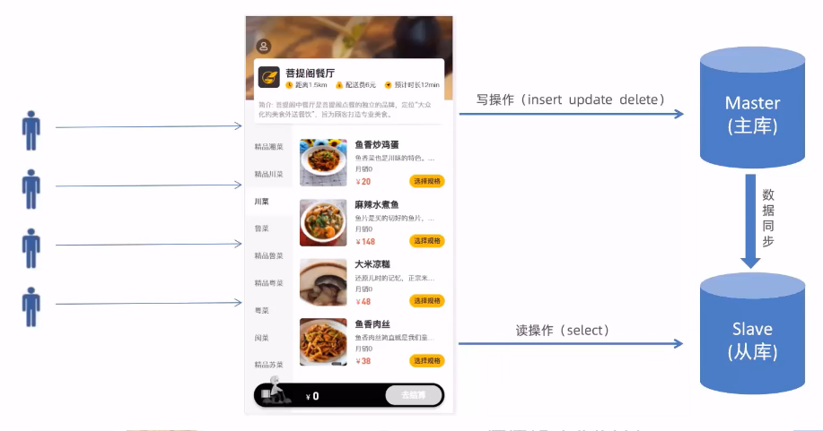

#### 2.1 MySQL主从复制

- MySQL主从复制是一个异步的复制过程，底层是基于Mysql数据库自带的二进制日志功能。就是一台或多台NysQL数据库（slave，即从库）从另一台MySQL数据库(master，即主库）进行日志的复制然后再解析日志并应用到自身，最终实现从库的数据和主库的数据保持一致。MySQL主从复制是MySQL数据库自带功能，无需借助第三方工具。
- MySQL复制过程分成三步:
  1. `maste`r将改变记录到二进制日志(`binary log`)
  2. `slave`将`master`的`binary log`拷贝到它的中继日志(`relay log`)
  3. `slave`重做中继日志中的事件，将改变应用到自己的数据库中

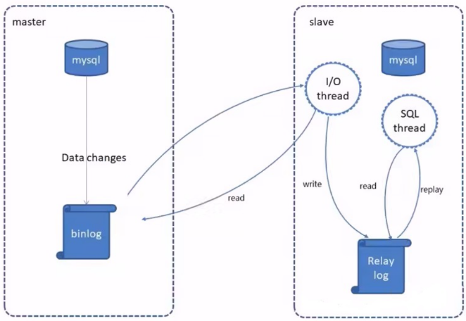

#### 2.2 搭建MySQL主从服务

https://www.bilibili.com/video/BV13a411q753/?p=173

https://cyborg2077.github.io/2022/10/18/ReggieOptimization/#MySQL%E4%B8%BB%E4%BB%8E%E5%A4%8D%E5%88%B6

#### 2.3 读写分离

##### 2.3.1 Sharding-JDBC

- Sharding-JDBC定位为轻量级的JAVA框架，在JAVA的JDBC层提供额外的服务，它使得客户端直连数据库，以jar包形式提供服务，无需额外部署和依赖，可理解为增强版的JDBC驱动，完全兼容JDBC和各种ORM框架
- 使用Sharding-JDBC可以在程序中轻松的实现数据库读写分离
  - 适用于任何基于JDBC的ORM框架
  - 支持任何第三方的数据库连接池
  - 支持任意实现JDBC规范的数据库
- 使用Sharding-JDBC框架的步骤
  1. 导入对应的maven坐标
  2. 在配置文件中配置读写分离规则
  3. 在配置文件中配置允许bean定义覆盖配置项

##### 2.3.2 读写分离案例

代码在【D:\MyITData\B站\Java\黑马\瑞吉外卖资料\5 瑞吉外卖项目优化篇\资料\day02\rw_demo】

导入`Sharding-JDBC`的maven坐标

```xml
<dependency>
    <groupId>org.apache.shardingsphere</groupId>
    <artifactId>sharding-jdbc-spring-boot-starter</artifactId>
    <version>4.0.0-RC1</version>
</dependency>
```

在配置文件中配置读写分离规则,配置允许bean定义覆盖配置项，配置项可能会爆红，但是不影响影响项目启动，是IDEA的问题。

```yaml
server:
  port: 8080
mybatis-plus:
  configuration:
    #在映射实体或者属性时，将数据库中表名和字段名中的下划线去掉，按照驼峰命名法映射
    map-underscore-to-camel-case: true
    log-impl: org.apache.ibatis.logging.stdout.StdOutImpl
  global-config:
    db-config:
      id-type: ASSIGN_ID
spring:
  shardingsphere:
    datasource:
      names:
        master,slave
      # 主数据源
      master:
        type: com.alibaba.druid.pool.DruidDataSource
        driver-class-name: com.mysql.cj.jdbc.Driver
        url: jdbc:mysql://192.168.138.100:3306/yatakeout?characterEncoding=utf-8
        username: root
        password: 123456
      # 从数据源
      slave:
        type: com.alibaba.druid.pool.DruidDataSource
        driver-class-name: com.mysql.cj.jdbc.Driver
        url: jdbc:mysql://192.168.138.101:3306/yatakeout?characterEncoding=utf-8
        username: root
        password: 123456
    masterslave:
      # 读写分离配置
      load-balance-algorithm-type: round_robin #轮询
      # 最终的数据源名称
      name: dataSource
      # 主库数据源名称
      master-data-source-name: master
      # 从库数据源名称列表，多个逗号分隔
      slave-data-source-names: slave
    props:
      sql:
        show: true #开启SQL显示，默认false
  main:
    allow-bean-definition-overriding: true
```

##### 2.3.3 本项目的读写分离

没有实现，因为没有搭建MySQL主从服务器。参考【2.3.2】就行。

https://www.bilibili.com/video/BV13a411q753/?p=177


### 3、Nginx

本项目没有使用到Nginx，只是讲解了Nginx相关的知识点。

#### 3.1 Nginx介绍

- Nginx是一款轻量级的`Web`/`反向代理`服务器以及电子邮件(IMAP/POP3)代理服务器，其特点是占有内存少，并发能力强。
- 官网：https://nginx.org/

#### 3.2 下载安装

官网下载链接：https://nginx.org/en/download.html

安装过程：

1. Nginx是C语言开发的，所以需要先安装依赖

   ```bash
   yum -y install gcc pcre-devel zlib-devel openssl openssl-devel
   ```

2. 下载Nginx安装包

   ```shell
   wget https://nginx.org/download/nginx-1.22.1.tar.gz
   ```

3. 解压，我习惯放在

   ```shell
   /usr/local
   ```

   目录下

   ```shell
   tar -zxvf nginx-1.22.1.tar.gz -C /usr/local/
   ```

4. 进入到我们解压完毕后的文件夹内

   ```shell
   cd /usr/local/nginx-1.22.1/
   ```

5. 建安装路径文件夹

   ```shell
   mkdir /usr/local/nginx
   ```

6. 安装前检查工作

   ```shell
   ./configure --prefix=/usr/local/nginx
   ```

7. 编译并安装

   ```shell
   make && make install
   ```

#### 3.3 Nginx目录结构

- 重点目录/文件:
  - conf/nginx.conf
    - nginx配置文件
  - html
    - 存放静态文件(html、css、Js等)
  - logs
    - 日志目录，存放日志文件
  - sbin/nginx
    - 二进制文件，用于启动、停止Nginx服务

#### 3.4 Nginx配置文件结构

- Nginx配置文件(conf/nginx.conf)整体分为三部分
  - 全局块 和Nginx运行相关的全局配置
  - events块 和网络连接相关的配置
  - http块 代理、缓存、日志记录、虚拟主机配置
    - http全局块
    - Server块
      - Server全局块
      - location块

> 注意：http块中可以配置多个Server块，每个Server块中可以配置多个location块。

#### 3.5 Nginx应用

##### 3.5.1 部署静态资源

- Nginx可以作为静态web服务器来部署静态资源。静态资源指在服务端真实存在并且能够直接展示的一些文件，比如常见的html页面、css文件、js文件、图片、视频等资源。
- 相对于Tomcat，Nginx处理静态资源的能力更加高效，所以在生产环境下，一般都会将静态资源部署到Nginx中。
- 将静态资源部署到Nginx非常简单，只需要将文件复制到Nginx安装目录下的html目录中即可。

##### 3.5.2 反向代理

正向代理

- 正向代理是一个位于客户端和原始服务器（origin server)之间的服务器，为了从原始服务器取得内容，客户端向代理发送一个请求并指定目标（原始服务器），然后代理向原始服务器转交请求并将获得的内容返回给客户端。

- 正向代理的典型用途是为在防火墙内的局域网客户端提供访问Internet的途径。

- 正向代理一般是在客户端设置代理服务器，通过代理服务器转发请求，最终访问到目标服务器。

  

反向代理

- 反向代理服务器位于用户与目标服务器之间，但是对于用户而言，反向代理服务器就相当于目标服务器，即用户直接访问反向代理服务器就可以获得目标服务器的资源，反向代理服务器负责将请求转发给目标服务器。

- 用户不需要知道目标服务器的地址，也无须在用户端作任何设定。

  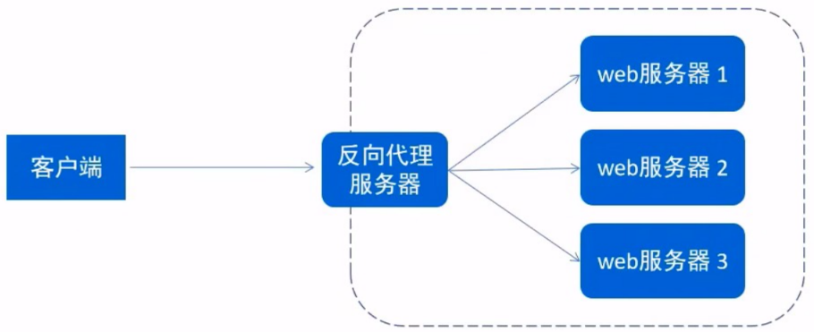

##### 3.5.3 负载均衡

- 早期的网站流量和业务功能都比较简单，单台服务器就可以满足基本需求，但是随着互联网的发展，业务流量越来越大并且业务逻辑也越来越复杂，单台服务器的性能及单点故障问题就凸显出来了，因此需要多台服务器组成应用集群，进行性能的水平扩展以及避免单点故障出现。
- 应用集群：将同一应用部署到多台机器上，组成应用集群，接收负载均衡器分发的请求，进行业务处理并返回响应数据。
- 负载均衡器：将用户请求根据对应的负载均衡算法分发到应用集群中的一台服务器进行处理。

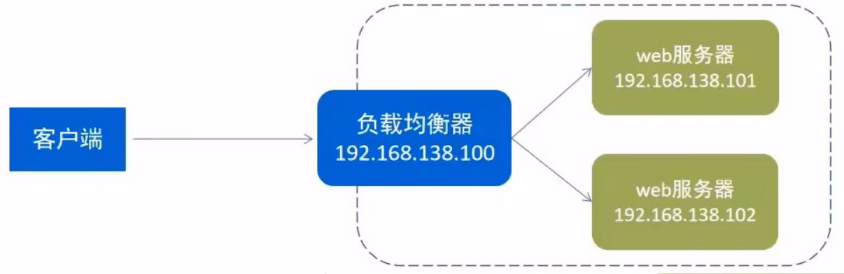

### 4、前后端分离

#### 4.1 前后端分离开发介绍

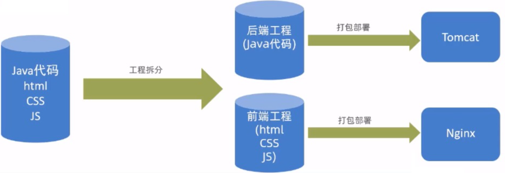


开发流程：

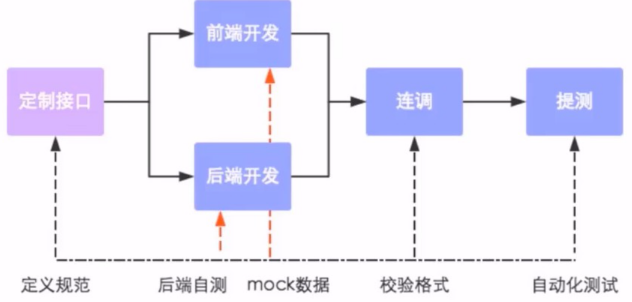

#### 4.2 YApi

- YApi是高效、易用、功能强大的api管理平台，旨在为开发、产品、测试人员提供更优雅的接口管理服务。可以帮助开发者轻松创建、发布、维护API，YApi还为用户提供了优秀的交互体验，开发人员只需要利用平台提供的接口数据写入工具以及简单的点击操作就可以实现接口的管理。
- YApi让接口开发更简单高效，让接口的管理更具有可读性、可维护性，让团队协作更合理。
- Git仓库：https://github.com/YMFE/yapi

这个其实是一个Web服务，要自己部署才能使用。

#### 4.3 Swagger

##### 4.3.1 使用流程

- 使用Swagger你只需要按照它的规范去定义接口及接口相关的信息，再通过Swagger衍生出来的一系列项目和工具，就可以做成各种格式的接口文档，以及在线接口调试页面等。
- 官网：https://swagger.io/

1. 导入对应的maven坐标，这里使用了knife4j框架，因为这个框架集成了Swagger。

   knife4j参考文档：https://doc.xiaominfo.com/

   ```xml
   <dependency>
       <groupId>com.github.xiaoymin</groupId>
       <artifactId>knife4j-spring-boot-starter</artifactId>
       <version>3.0.3</version>
   </dependency>
   ```

2. 开启接口文档，配置静态资源映射，并配置接口文档类型和接口文档版本与标题。

```java
@Slf4j
@Configuration
@EnableSwagger2 //开启接口文档类型Swagger2
@EnableKnife4j  //开启接口文档
public class WebMvcConfig extends WebMvcConfigurationSupport {
    /**
     * 设置静态资源映射
     * @param registry
     */
    @Override
    protected void addResourceHandlers(ResourceHandlerRegistry registry) {
        log.info("开始静态资源映射……");
        //接口文档Swagger的静态资源映射
        registry.addResourceHandler("doc.html").addResourceLocations("classpath:/META-INF/resources/");
        registry.addResourceHandler("/webjars/**").addResourceLocations("classpath:/META-INF/resources/webjars/");
        
        registry.addResourceHandler("/backend/**").addResourceLocations("classpath:/backend/");
        registry.addResourceHandler("/front/**").addResourceLocations("classpath:/front/");
    }

    /**
     * 扩展mvc框架的消息转换器
     * @param converters
     */
    @Override
    protected void extendMessageConverters(List<HttpMessageConverter<?>> converters) {
        log.info("扩展消息转换器...");
        //创建消息转换器对象
        MappingJackson2HttpMessageConverter messageConverter = new MappingJackson2HttpMessageConverter();
        //设置对象转换器，底层使用Jackson将Java对象转为json
        messageConverter.setObjectMapper(new JacksonObjectMapper());
        //将上面的消息转换器对象追加到mvc框架的转换器集合中
        converters.add(0,messageConverter);
    }

    /**
     * knife4j接口文档：文档类型Swagger
     * @return
     */
    @Bean
    public Docket createRestApi() {
        // 文档类型
        return new Docket(DocumentationType.SWAGGER_2)
                .apiInfo(apiInfo())
                .select()
                .apis(RequestHandlerSelectors.basePackage("com.ya.yatakeout.controller"))   //注意这里要修改为项目中controller的路径
                .paths(PathSelectors.any())
                .build();
    }

    /**
     * 接口文档：使用knife4j集成，配置接口文档版本与标题
     * @return
     */
    private ApiInfo apiInfo() {
        return new ApiInfoBuilder()
                .title("yatakeout")
                .version("1.0")
                .description("yatakeout接口文档")
                .build();
    }
}
```

3. 在拦截器在中设置不需要处理的请求路径

   ```java
   String[] urls = new String[]{
           "/employee/login",
           "/employee/logout",
           "/backend/**",
           "/front/**",
           "/common/**",
           "/user/sendMsg",
           "/user/login",
       	
       	//处理Swagger的静态文档
           "/doc.html",
           "/webjars/**",
           "/swagger-resources",
           "/v2/api-docs"
   };
   ```

   4. 启动服务，访问http://localhost:9090/doc.html即可看到生成的接口文档

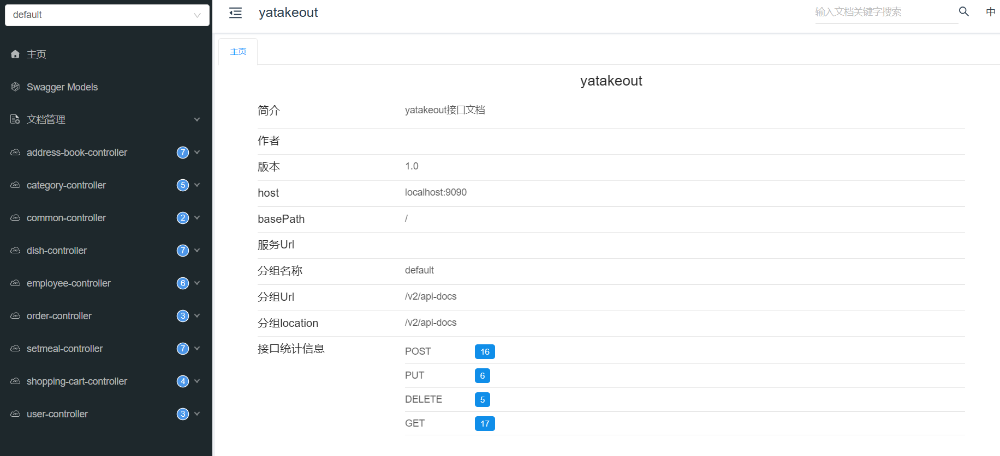

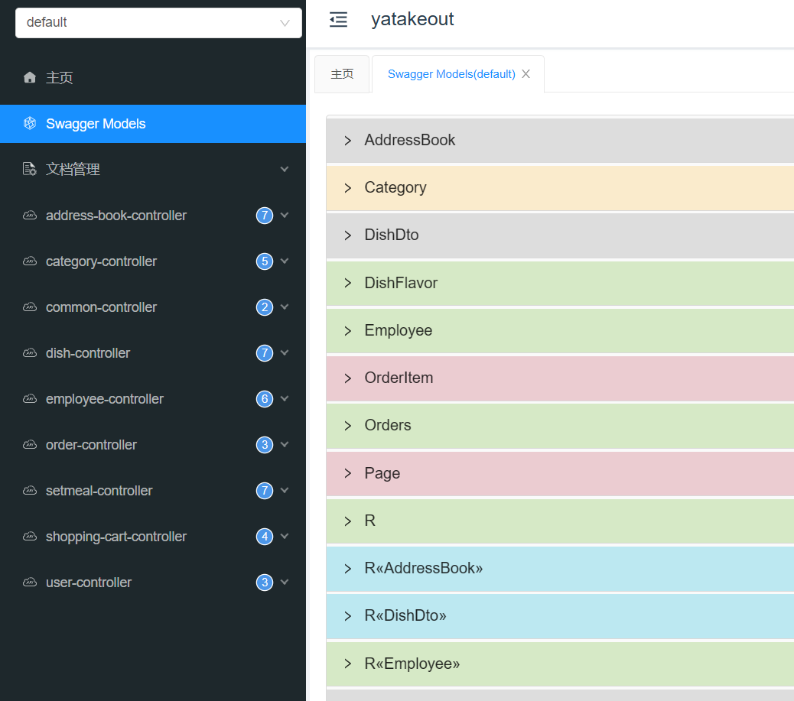

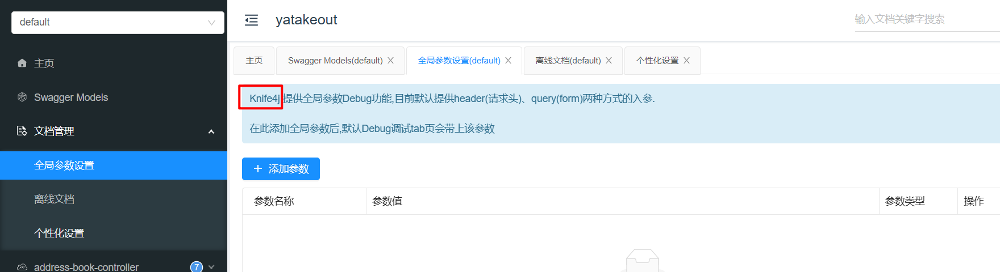

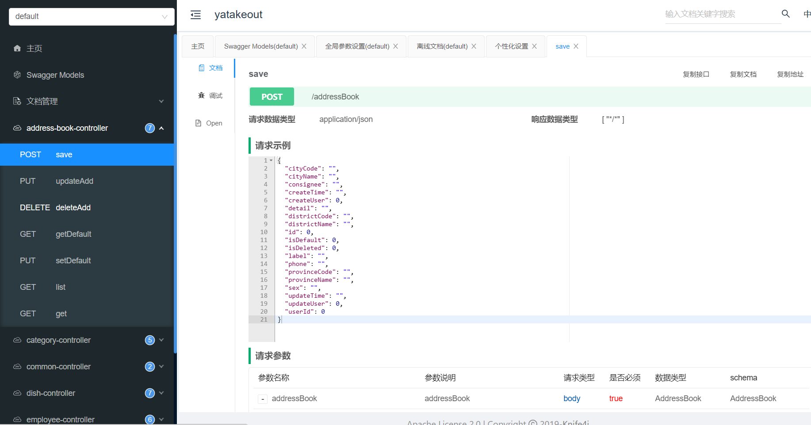

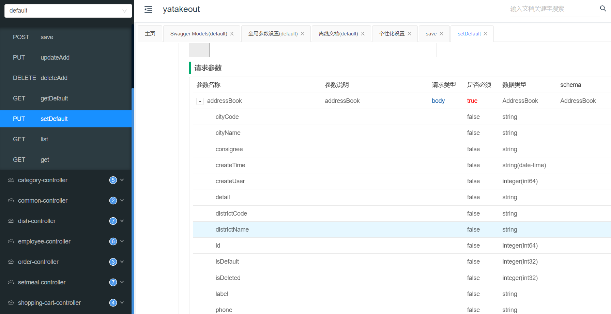


导出接口文档，导出的OpenAI文档可以导入YApi中


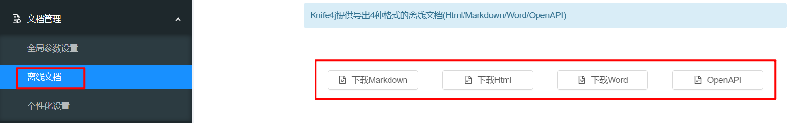

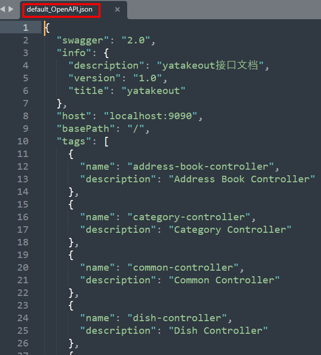

##### 4.3.2 常用注解

使用这些注解增强接口文档的可读性。

|        注解        |                           说明                           |
| :----------------: | :------------------------------------------------------: |
|        @Api        |      用在请求的类上，例如Controller，表示对类的说明      |
|     @ApiModel      |   用在类上，通常是个实体类，表示一个返回响应数据的信息   |
| @ApiModelProperty  |               用在属性上，描述响应类的属性               |
|   @ApiOperation    |          用在请求的方法上，说明方法的用途、作用          |
| @ApilmplicitParams |            用在请求的方法上，表示一组参数说明            |
| @ApilmplicitParam  | 用在@ApilmplicitParams注解中，指定一个请求参数的各个方面 |

如，在实体类Setmeal中添加注解@ApiModel和@ApiModelProperty：

```java
@Data
@ApiModel("套餐")     //设置接口文档
public class Setmeal implements Serializable {
    private static final long serialVersionUID = 1L;

    @ApiModelProperty("主键")
    private Long id;
    //分类id
    @ApiModelProperty("分类id")
    private Long categoryId;
    //套餐名称
    @ApiModelProperty("套餐名称")
    private String name;
    //套餐价格
    @ApiModelProperty("套餐价格")
    private BigDecimal price;
    //状态 0:停用 1:启用
    @ApiModelProperty("状态")
    private Integer status;
    //编码
    @ApiModelProperty("套餐编号")
    private String code;
    //描述信息
    @ApiModelProperty("描述信息")
    private String description;
    //图片
    @ApiModelProperty("图片")
    private String image;


    @TableField(fill = FieldFill.INSERT)
    private LocalDateTime createTime;
    @TableField(fill = FieldFill.INSERT_UPDATE)
    private LocalDateTime updateTime;
    @TableField(fill = FieldFill.INSERT)
    private Long createUser;
    @TableField(fill = FieldFill.INSERT_UPDATE)
    private Long updateUser;

}
```

在通用返回结果类R中添加注解：

```java
@Data
@ApiModel("返回结果")
public class R<T> implements Serializable {     //设置泛型

    @ApiModelProperty("编码")
    private Integer code; //编码：1成功，0和其它数字为失败

    @ApiModelProperty("错误信息")
    private String msg; //错误信息

    @ApiModelProperty("数据")
    private T data; //数据

    @ApiModelProperty("动态数据")
    private Map map = new HashMap(); //动态数据

    public static <T> R<T> success(T object) {
        R<T> r = new R<T>();
        r.data = object;
        r.code = 1;
        return r;
    }
    public static <T> R<T> error(String msg) {
        R r = new R();
        r.msg = msg;
        r.code = 0;
        return r;
    }
    public R<T> add(String key, Object value) {
        this.map.put(key, value);
        return this;
    }
}
```

在SetmealController中添加注解

```java
@RestController
@RequestMapping("/setmeal")
@Slf4j
@Api(tags = "套餐相关接口")
public class SetmealController {
	...
	@PostMapping
    @CacheEvict(value = "setmealCache", allEntries = true)  
    @ApiOperation(value = "新增套餐接口")
    public R<String> save(@RequestBody SetmealDto setmealDto){...}
    ...
    @GetMapping("/page")
    @ApiOperation(value = "套餐分页查询接口")
    @ApiImplicitParams({
            @ApiImplicitParam(name = "page",value = "页码",required = true),
            @ApiImplicitParam(name = "pageSize",value = "每页记录数",required = true),
            @ApiImplicitParam(name = "name",value = "套餐名称",required = false)
    })
    public R<Page> page(int page, int pageSize, String name){...}
    ...
}
```

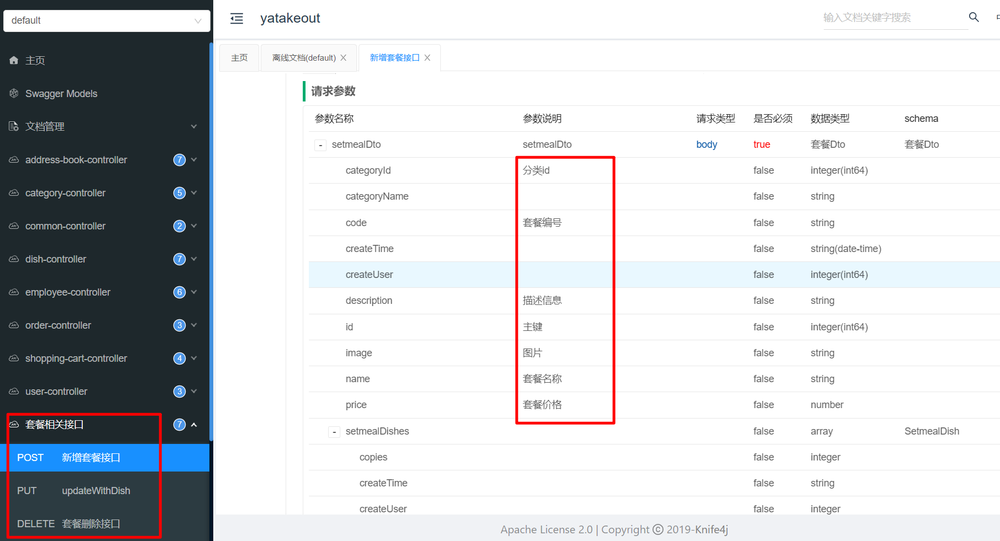

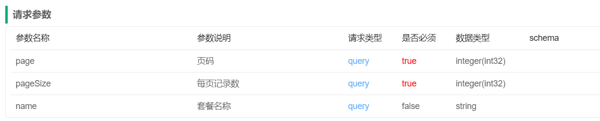

### 5、项目部署

#### 5.1 部署说明

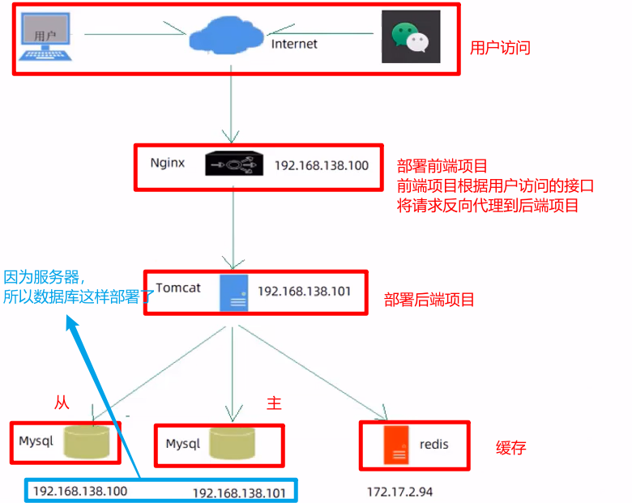

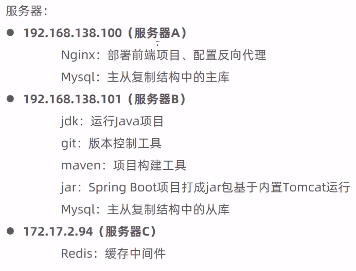

#### 5.2 前端项目部署

https://www.bilibili.com/video/BV13a411q753?p=190

- 在服务器100中部署，安装好Nginx，上传前端的打包文件`dist`到Nginx的html目录下

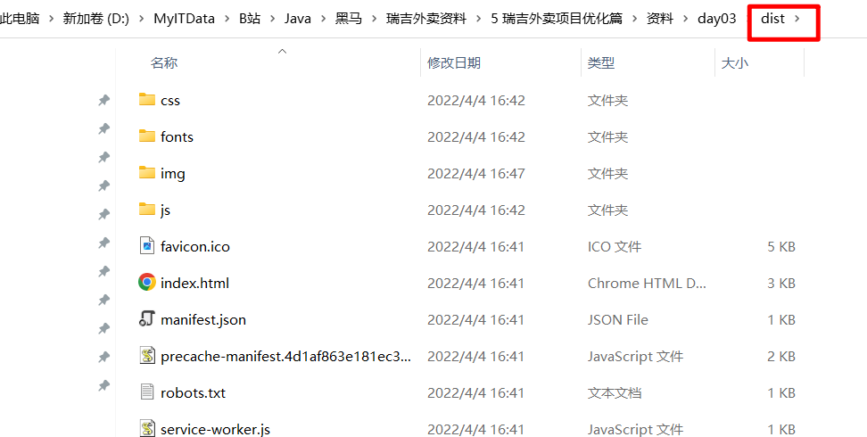

- 修改Nginx的配置文件nginx.conf，配置两个地方

  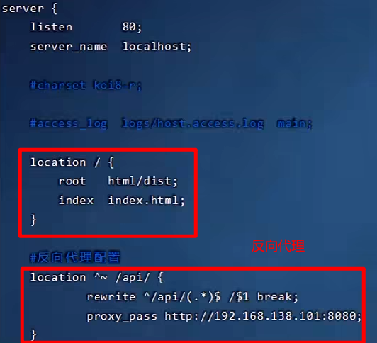

  

  前端发送的请求，多了个/api，而后端接口中是没有/api的，所以在nginx中需要处理一下

  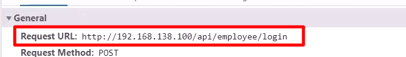
  
  
  
  ```shell
  rewrite ^/api/(.*)$ /$1 break;	#将/api/employee/login处理为/employee/login
  
  ^/api/(.*)$ 是一个用于匹配以/api/开头的URL路径的表达式，其中：
  	^ 表示匹配字符串的开始位置。
  	/api/ 匹配包含/api/子字符串的URL路径。
  	(.*) 匹配任意数量的任意字符，并将其保存在捕获组中，捕获组的索引为 1。
  	$ 表示匹配字符串的结束位置。
  经过^/api/(.*)$处理，/api/employee/login变为employee/login，employee/login即$1
  
  /$1中/表示加一个符号/，$1表示将(.*)的匹配视为一个整体。
  $1 则表示将匹配到的整个字符串替换为第一个捕获组中的内容。在这个例子中，$1 代表的就是(.*)中捕获的任意字符部分。
  
  break 则表示停止执行其他重写规则。
  ```

```
正则表达式：
 ^：起始符号，^x表示以x开头
 $：结束符号，x$表示以x结尾
 [n-m]：表示从n到m的数字
 \d：表示数字，等同于[0-9]
 X{m}：表示由m个X字符构成，\d{4}表示4位数字
```

  ```shell
proxy_pass http://192.168.138.101:8080	#表示方向代理到http://192.168.138.101:8080
  ```

  

#### 5.3 后端项目部署

https://www.bilibili.com/video/BV13a411q753?p=191

- 在101服务器，安装好JDK、git、maven、MySQL（mysql在之前的读写分离中已经部署好了，分为主从服务器）

- 使用Git命令将项目从github上clone下来

- 上传自动化部署脚本`reggieStart.sh`，使用`chmod 777reggieStart.sh`命令授予权限，运行脚本`./`reggieStart.sh

  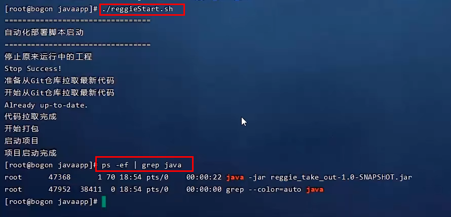

  

- 修改图片存储位置application.yml：

```yaml
yatakeout:
# 文件上传的保存目录
  path: D:\MyITData\JavaIDEA\JavaProject\yatakeout\img\
```

```yaml
yatakeout:
# 文件上传的保存目录
  path: /usr/local/img/		#要先将图片文件上传到服务器里，上传到后端项目的服务器
```

- 生成的日志在target里面

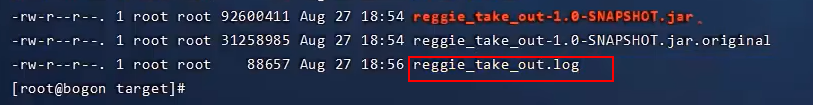


